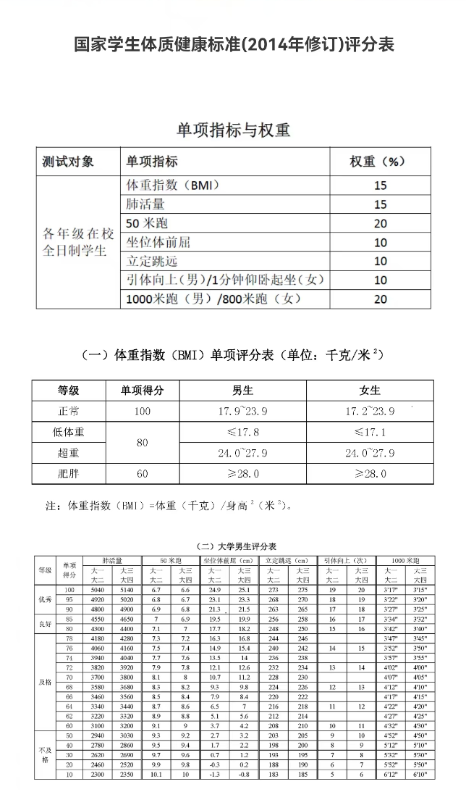
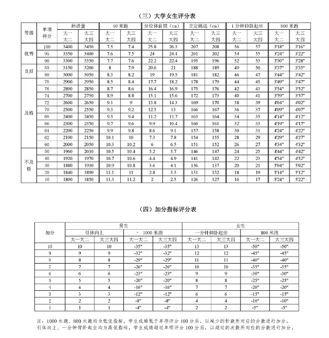

# 课程学习建议

!!! abstract
    这是 2025 级图灵班学长组为大家准备的课程学习建议，将为大家具体介绍大一新生应该着重注意的学习事项。
    
    此外，对于大一秋冬学期的所有课程，请在[图灵班学习指南](https://zju-turing.github.io/TuringCourses/)网站查看。该网站整合了通识选修课以及图灵班各个学年的各种课程。
    
    这些都是由往届的学长们（现在的学爷学祖）编写的课程学习建议修缮而来。对于大一的课程学习有很大帮助，建议仔细阅读，常看常新。

## 前言

为了便于大家适应高中学习与大学学习的不同，并且帮助大家较为顺利地学到所需的知识，得到理想的成绩，我们准备了大一学年的课程学习建议。这份资料可以从学期开始前熟悉到学期开始时寻求建议到考前复习都有作用。我们对所有课程学习都给出了参考书籍、选老师的建议，并且根据不同同学的需求（通过考试或者有更高目标等）给出了建议。

除此之外，对于通识选修课部分，我们也收集了图灵班众多学长的上课体验和总结的经验，更详细的内容都在[学习指南](https://zju-turing.github.io/TuringCourses/general/)中，对于选课、上课应该都会有帮助。

总之希望大家能从选课到学习、考试，都能事半功倍！

### 高中学习与大学学习的区别

1. 老师的区别
    - 高中老师更像保姆，会非常关心你的学习状态以及成绩波动等；
    - 但是大学老师，除了个别老师有高中老师风格外，说得不那么好听，就是只负责两件事：上课和给分。上完课老师拍屁股走人，考试挂科了老师就给你挂科就行，其余概不负责。
2. 自学更为重要
    - 大学老师一节课的内容甚至足够高中老师讲一个星期，高中是一个知识点反复咀嚼，用题目巩固，大学是知识点直接摆在你面前，更何况有些老师讲课水平实在有限，因此自学十分重要；
    - 自学可以自己看书，参考 B 站网课。除此之外，网上还有很多电子书网站，例如 Z-library，内容都十分广泛。在课本的选择上，一般而言，不需要遵循网上的评论，只需要拿到书的电子版，看完前言和第一章，就可以知道自己能不能把这本书看下去。另外，课程的推荐教材也是必须重视的，虽然有些会编的十分糟糕，但考试重点多半也是推荐教材上的重点；
    - 另外，大学与高中的不同点在于，教材之外还需要看参考文献。一般来讲，sci-hub, arxiv 是查文献必备的网站，尤其是 sci-hub，一般给出资料的 doi 就可以下载了，缺点是需要找可用的镜像站，只要百度一下，一般都有；
    - 碰到 bug、问题或者需求善于从互联网获取解决方案。请不要使用 csdn 查找解决方案，因为不仅存在大量相互抄袭与错误，而且相对过时；请在 stack overflow 以及其他 stack exchange 系列论坛提问与搜索解决方案；在学习使用各种工具/软件时，遇到问题不妨先查看官方文档（哪怕是英文文档，此事在[实用工具推荐](tools.md)中亦有记载），很多时候问题都能迎刃而解；
    - 善于使用 GitHub，GitHub 不仅有广泛的开源软件的项目，更是将来你们合作开发与托管代码的重要平台。最好能学会使用 Typst，TeX 和 markdown，是写报告与论文的优秀工具。
3. 大学考试周压力更大
    - 因为平时任务多，并且有些同学可能自律性不强，因此可能考试周前需要复习（预习）大量内容；
    - 实际上挂科乃至退院离大家并不远，不要盲目自信，不要过度摆烂以及过于依赖考试周补天；
    - 考试周破防是正常的，平常任务多 ddl 多破防都是正常的，大家要适应，并且有时候不要太浪；
    - 只要你愿意好好学习，挂科退院等会远离你的。
4. 大学更为自由
    - 没有人管你想要干什么，学什么，这是一把双刃剑，因为自律性不强的同学可能会学习不够上心而离开图灵班，但是同时也有好处就是你可以选择更好的老师，更好的课程，学自己喜欢的课程（比如人文社科类课程）；
    - 把握好这个自由的机会很重要。

### 在浙大学习需要注意什么

1. 选课很重要
    - 良好的选课是事半功倍的基础；
    - 浙大选课并非先来后到，是所有待选同学按概率筛选，因此欧皇才可以选上好课（×）；
    - 善于利用补选以及图灵班选课的优势是重要的基础；
    - 看清楚老师的风格很重要，无论是上课讲得如何还是给分有多烂，都一定要事先了解再做选课决定。
2. 课程会限制优秀率
    - 在 2022 级之前，通识课程分数都实行正态分布，专业课不限制，而后来变成了带 H 的通识课外的其它所有课程限制优秀率（但实际上专业课老师可以调整）；
    - 也就是每一门课程都最多只能有 30% 的同学达到优秀（90 分及以上）。
3. 浙江大学学习较为自由
    - 因此大家可以按照自己的能力将自己的课表填充得更为充实，想要辅修或者双学位的都是很自由的，到学校后下发的学生手册上会有相关政策；
    - 有能力的也可以直接选择超前课程学习。
4. 学会获得历年卷
    - 可以到蓝田文印店购买历年试卷作为考试复习资料，这些题目主要可以大致帮助各位同学了解试题难度以及题型，不过蓝田的历年卷大多年代久远，仅当参考即可；
    - 我们也会发布一些图灵班同学自行整理的回忆卷作为参考，都是近两年考后回忆出来的题目，参考价值大于蓝田历年卷（希望各位可以延续回忆卷的传统，造福学弟学妹们）。

!!! Warning "请不要将图灵回忆卷出于任何目的售卖或变相售卖给文印店！"

## 课程学习建议

在[图灵班学习指南](https://zju-turing.github.io/TuringCourses/)中有各门课程的学习建议，这里也放上各位学长学姐的相关建议：

由于培养方案的改动，可能会有一些课程的安排有所不同，因此请大家根据自己的培养方案进行查看。

### 大一秋冬

- [数学分析（甲）Ⅰ（H）](https://zju-turing.github.io/TuringCourses/math_phys/math_analysis1/)
- [线性代数 Ⅰ（H）](https://zju-turing.github.io/TuringCourses/math_phys/linear_algebra1/)
- [程序设计与算法基础](https://zju-turing.github.io/TuringCourses/major_basic/programming/)
- [中国近现代史纲要（H）](https://zju-turing.github.io/TuringCourses/political/modern_history/)
- [思想道德与法治](https://zju-turing.github.io/TuringCourses/political/morality_law/)
- [形势与政策 Ⅰ](https://zju-turing.github.io/TuringCourses/political/situation_policy1/)

### 大一春夏

- [数学分析（甲）Ⅱ（H）](https://zju-turing.github.io/TuringCourses/math_phys/math_analysis2/)
- [线性代数 Ⅱ（H）](https://zju-turing.github.io/TuringCourses/math_phys/linear_algebra2/)
- [普通物理学 Ⅰ（H）](https://zju-turing.github.io/TuringCourses/math_phys/physics1/)
- [普通物理学实验 Ⅰ ](https://zju-turing.github.io/TuringCourses/math_phys/physics_experiment1/)
- [离散数学理论基础](https://zju-turing.github.io/TuringCourses/major_basic/discrete_math/)

## 补充及注意事项

### 其它选修/思政课程

- 关于四史、创新创业、跨专业、外语的具体课程经验见图灵班学习指南的[通识选修课经验 > 其它选修课](https://zju-turing.github.io/TuringCourses/general/others/)部分，这些课的介绍在本页下面有补充
- 其他思政课程还有：马克思主义原理基本概论（H）、毛泽东思想和中国特色社会主义理论体系概论（H）、习近平新时代中国特色社会主义思想概论，还有一门军体类理论课军事理论
    - 这些课注意带（H）的一定不能选不带（H）的，否则修了白修！！！
    - 这些课修读时间随意，只要你愿意，大一全上完都可以（×）
    - 当然还是建议按培养方案修读，否则一堆思政课期末考试会非常痛苦

### 外语类部分

图灵培养方案没有修英语课的要求。但是有 1 学分认定学分来源于六级、托福雅思、学校组织的考试达到一定要求，具体内容参看培养方案。因此，在选课时可以不必选择英语课。

!!! Warning "注意"
    慎选“大学英语”课程，大部分学习内容对于提升你的英语水平没有什么帮助，并且事多给分一般，如果实在想修英语课可以选择托福系列课程，至于英语口语、英语写作课程作用不大，也没有必要选择，所以建议同学们还是不要修读英语类课程。如果愿意修读大英 Ⅳ（H）课程，推荐方富民老师，课程较为有趣且对英语方面有帮助。

#### 关于四六级考试

大学英语四六级考试一般在每年的 6 月（很可能夹在期末周中）和 12 月，届时学校会给出报名通知，同学们根据个人选择自行报名。根据教育部规定，四六级考试不设置及格线，但是四级 425 分以上才可以报名六级考试。另外，如果六级笔试分数高于 550，口试分数在 B+ 及以上，可以申请免除培养方案汇总外语能力测试的内容。此外，保研和直博等对六级分数都有相应限制。通俗来讲，四级笔试分数一定要超过 425，分数更高无太大差别，四级口试没有特别必要报名。六级分数越高越好，建议报名口试。对于准备方面，四级并不需要特别备考，仅靠高中基础可以轻松地应对，基础较好的同学甚至可以考虑裸考（×）。六级难度相对大一些，准备时可以刷一些真题。平时若需要的话，建议着重从单词和听力两个方面的内容提升基础。

### 创新创业类部分

创新创业类课程是响应国家号召而开设的课程，该类课程有：

- **创业启程**
    - 俗称退院启程（×）
    - 有课程期末考试，曾经是事多分少的典型，现在有较大改善
    - 目前情况是纯网课，网课会有一个大作业要写一个商业计划书，之后每周一次讲座，要求至少听两场写观后感
    - 有一本教材，期末考试考前六章的内容，事情真的不多，笔者的经历是纯划水，最后不挂就行。还是能学到很多关于创业的知识的
- **职业生涯规划**
    - 职业生涯规划普遍任务有上课分组游戏、职业生涯规划书、采访、展示等。细节以鲍雨欣老师职规为例，首先会分组，一组 8 人左右，上课以理论为主，介绍自我性格探索、职业能力探索、职业选择决策，每节课也会有组内组间小游戏之类的互动。考核方式是职业规划书（占45，其中 5 分人物访谈）+小组展示（50 分）+课堂表现（5 分），职业规划书就从老师给的几个方面认真分析一下，字数和形式没有内容重要，人物访谈不做硬性要求，但非常推荐做，就是采访业内人士；小组展示的话一般是确认好主题、表现形式，然后最后展示一下；
    - 蔡云姐姐人美事少给分高，一般都是需要极为离谱的运气才能选上。学长本人当时躺平了，被组内 dalao 带飞了，不需要准备任何前置知识。无考试，期末考核为一个 8min 的小组节目（与职业规划相关）。然而蔡云姐姐现在也不教职规了……
- **创业基础**
- ……

### 体育课部分

浙江大学体育课是需要上六个学期（正常而言大一到大三），一个学期选一门（一个体育项目，称为体育专项课，除了身体有严重问题不能上体育课的选择普通体育课），一个星期上一次（2 节 45 分钟），大一还有一门身体素质课（又称体育专项辅导课）。  

体育专项课是例如足球、篮球等的专项体育课程，除此之外，浙大体育课涵盖所有热门项目足篮排乒羽等，还有桥牌、高尔夫、拳击、攀岩、定向越野、无线电测向等新奇课程（遗憾的是台球没有，但是有相关社团）。  

体育课最出名的一定是水上运动了，例如游泳、龙舟、皮划艇、皮艇球等，应有尽有，十分有趣。选课时只能选择一门，有些课程非常热门，很难选进，但是也有健美操、体育舞蹈、女子防身术等课程留有余量可以补选。不同学期可以尝试不一样的项目，十分充实，当然也可以每个学期选择相同的项目。  

另外，除了专项体育课，**所有大一同学**必须同时选一门身体素质课。身体素质课基本安排在下午九、十节，一般而言由老师带领同学做一些体能训练项目，具体内容和老师专长有关。当然有些老师可能比较划水，直接放同学跑步打卡。需要注意的是，身体素质课本身不算学分（不过出勤情况会算到专项体育课的总评成绩中（10 分），所以不用过多考虑老师的评价，选课时只需考虑自己合适的时间即可。

**体测是评奖评优的重要依据**，至少需要合格才能获得奖学金，良好才能获得一等（及更高等）奖学金，平均分 50 也是毕业硬指标。（注意大一上体测用于大一学年奖学金评选，大一下及大二上体测用于大二学年奖学金评选，以此类推）项目和评分标准如下图所示（其实浙大体艺上有）：

注意下载**浙大体艺** APP，打卡、体测和体育成绩、上课签到也会在这个 APP 上进行。

**体育课分数构成如下**：

- 体育课成绩 != 体测成绩
- 体育课成绩 = 40% 体育专项考核 + 15% 课外锻炼 + 10% 课程考勤 + 10% 理论考试 + 25% 身体素质 + 2%（如果有）参与体育竞赛（每学期都会有类似于趣味运动会的，很轻松，参加即可，不用担心）。
- 身体素质部分在春夏学期由体测成绩决定，在秋冬学期由 十二分钟跑（20%）+ 男生引体向上、女生仰卧起坐（5%）决定（十二分钟跑，2800 米满分，2200 米及格）。
- 理论考试部分在大一上由智慧树线上学习决定，之后就由上机专项考试决定，考试内容为所选课程的专业知识+体育健康知识（开卷考试，均为选择判断，注意打印好资料）。

### 其它问题

#### 成绩与绩点

绩点可以说是大学里最重要的评价方式了，绩点的高低和保研、评奖评优乃至导师对你的态度都关系密切。均绩的计算方式是 ∑(课程绩点×课程学分)/总学分。对于不同类别的课程有时会分别计算绩点，其中最主要的是主修课程均绩与全部课程均绩，大部分院系的学业成绩都是主要由这两种均绩以及一些另外的指标如总学分、研究创新分数等加权计算得到。

而对于每一门课程绩点的计算，浙大现在基本采用百分制（详见下图）。大部分课程都是采用百分制（也就是所谓的三分一档）。目前所有课程都会限制优秀率，也就是 90 分及以上的人数最多 30%（所以有些善良的老师可能会在 89 堆很多同学，因为 89 与 90 一样绩点都是 4.5 且不占优秀率）。对于限制优秀率，大家务必摆正心态，同时做好进行残酷竞争心理准备。（图中的五分制仅作为参考，目前已不使用）

关于绩点一些常见“黑话”：

- **卡绩**：指获某档的最高分，即差一分就可以拿到更高一级的绩点。如获 94，91，88，79 分等
- **绩杀**：指绝大部分乃至所有人的绩点都很低
- **被捞**：狭义指应当挂科者低空飘过（绩点 1.5），广义指获得了高于实力所配的高绩点
- **斩杀**：指期末考太低，捞不起来；期末考分数太低，低于“斩杀线”，直接挂科处理。具体分课程、分老师，目前大部分课程应该没有斩杀线

#### 自我定位

正如前文所说浙江大学学习较为自由且在大学中自学尤为重要。而在大一秋冬学期部分同学可能会因为没有很好的自我定位所以没有专心于学业抑或是学有余力却无从下手。

根据大家在必修课程中个体的学习压力不同,我们分为以下两类:

- **学有余力**:
有一定竞赛基础的同学在数分、线代及程算等课程的学习上可能会相对轻松一些，但这也不意味着能轻松地获得高分。如果对绩点有追求，则应当在将作业认真完成的基础上做一些适当的拓展，比如线代可以多看看 LALU，数分可以多做做谢惠民。（一件耐人寻味的事是，22，23，24三年数分Ⅱ的压轴/次压轴题是谢惠民某一节的连续四道题，<del>所以做谢惠民没准能切实地提高成绩</del>）当然，在学有余力的情况下，也可以学习各种实用技能或一些自己真正感兴趣的知识,例如 CTF（×）。

- **较为吃力**:
即使学习起来较为吃力，也至少应把不挂科作为自己的底线，不要觉得难就开摆。这类同学可以多与身边的同学交流，也可以多参加辅学，建立起对学科知识整体框架的认识，遇到不懂的问题多在辅学群里问。鉴于大一秋冬学期的课程难度不是特别大，所以只要认真学了，挂科的可能性也并不大。

#### 教材问题

教材会在选课的某一阶段通知各位预订，当然有些教材并不需要预定，之前也已经提到。当然也可以在蓝田二手书店购买（有点坑），也可以在淘宝、咸鱼等处购买二手书，也可以从校园论坛处关注卖书贴，也可以在学长学姐处白嫖（×）。电子版教材之前也有介绍在哪里可以寻找，当然也可以在群内、网盘共享。当然有像我一样的忠实一手实体书爱好者可以关注当当淘宝等促销活动获得较为实惠的一手实体砖块。关于教材问题的相关 Q&A 见 [Q：关于课程教材](qa.md#q_27)。

#### 图灵研讨班

主要是请计算机界的大牛人物来进行讲座，可参加可不参加，四年去够 8 次可以拿到 0.5 专业选修课学分。如果对演讲者的演讲内容感兴趣可以参加，不然不参加也是完全没问题的，因为很多时候也并不能听懂大佬在说什么。

#### 挂科问题

一般而言体育课不可能挂科，因为有签到、打卡、理论考等送分项目，但是体育挂科也是主修课挂科，也要退出竺可桢学院。思政课只要你考试思想端正，平时不是啥也没做，100% 不会挂科。至于主修课，有的老师捞人，但是你不能触碰底线，就算学不懂，我前面也说了怎么过考试的方法，一定要学一点东西。而且竺院课程没有补考，所以挂科只能重修。

#### 退院问题

也就是所谓的“分流”（从竺可桢学院分流出去），图灵班的分流政策详见群文件。概括来说，大一大二两年内触发以下任意一条就会退院：

- 某长学期主修均绩或全部均绩低于 3.0
- 某长学期获得学分小于 20
- 主干课程挂科

此外还有倒数 30% 的警告制度，不过应该没有同学因为被警告而退院。面对分流政策各位也不用慌张，只要认真学习了，且没在一个学期内修读很多很难的硬课，一般不会触发退院。但也不能完全放松警惕，退院仍在你我身边。
