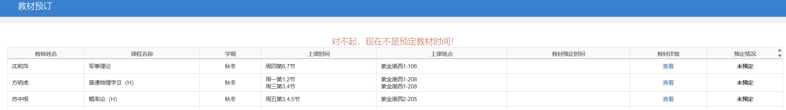

# 图灵班选课指南

!!! Warning 
    本内容在之前的选课指南上进行了更改，但是由于 25 级的某些通知尚未出台，其中的部分通知链接仍然保持为 24 级的相应通知，仅供形式上参考，细节之处以 25 级通知为准。

!!! abstract
    本文主要在 23、24 学长组诚邀学祖编写的基础上，由 25 学长组进行了一定程度的改写，介绍了和选课相关的必要知识以及选课方法。

    选课可能看起来会比较复杂，但各位不用担心，届时我们学长组也会细致讲解，甚至到寝室手把手教学，同时也欢迎大家在群里提问或者私戳学长。在实操选课之后大家就能更好地理解整个选课流程和技巧了。

本文主要帮助大家了解大一秋冬的选课流程，对于以后选课流程可能会出现的小部分变化，请以通知为准，同时每次选课之前请务必注意通知中的细节之处。

除了本文之外，浙江大学新生指引（下）的彩票系统特别篇也是一个很好的参考（**但是 25 级的教务网会直接指向教学管理信息服务平台即  [zdbk.zju.edu.cn](https://zdbk.zju.edu.cn/)，所以下面的 pdf 仅供参考**）：

新生指引彩票系统特别篇

3.28 MB / 25 P

<a class="down-button" target="_blank" href="https://cdn.tonycrane.cc/turing2022/files/%E6%96%B0%E7%94%9F%E6%8C%87%E5%BC%95%E5%BD%A9%E7%A5%A8%E7%B3%BB%E7%BB%9F%E7%89%B9%E5%88%AB%E7%AF%87.pdf" markdown="1">:fontawesome-solid-download: 下载</a>

## 选课的基本知识

1. 浙江大学的选课是概率筛选（补选、低分定点除外），所以不必因为想要抢课而购买更高一级的网络套餐。同时选课是分轮次进行的，在不同的轮次会有不同的选课、退课、优先级安排，需要认真阅读教务网的通知。
2. 选课的过程基本都在教务网（本）进行，网站的全称为**本科教学管理信息服务平台**，网址为 [zdbk.zju.edu.cn](https://zdbk.zju.edu.cn/)，使用统一身份认证登录即可。也可以通过 [ZJUers轻首页](https://zjuers.com/)，在**浙大 · 教学**板块中访问教务网。
3. 选课的阶段一般分为四个轮次，详见 [25 级通知](https://zdbk.zju.edu.cn/jwglxt/xtgl/xwgl_ckXw.html?xwbh=3C0F1A1F50FB50FAE0632AB3CA0AAAA3&doType=save)。下面分别简单介绍：
    - 第一二轮选课：都是正常的概率筛选。
    - 第三轮选课：在第三轮选课的时候，还带有补选和低分定点选课这两个阶段，可以参考 [24 级通知](https://zdbk.zju.edu.cn/jwglxt/xtgl/xwgl_ckXw.html?xwbh=20F4CA3AF0EF42EAE0630CA6CA0A54E2&doType=save)。
    - 第四轮选课：在冬学期或夏学期开始前进行，可以进行冬学期或夏学期课程的选退课，可以参考 [24 级通知](https://zdbk.zju.edu.cn/jwglxt/xtgl/xwgl_ckXw.html?xwbh=2546DF2AE3053678E0630CA6CA0A26D1&doType=save)。
4. 对于大一秋冬的选课过程，在一轮选课当中，会有预定教材的通道，想订购教材的同学需要关注。如果在系统上预订教材，费用在开学时预缴的教材费中自动扣除，毕业时会多退少补。同时也不是所有的课程都需要教材的，对于是否需要预定某门课程的教材，可以在群里咨询学长。

## 培养方案的解读

培养方案说明了毕业需要修读的课程以及推荐每学年应当修读的课程，因此必须引起重视。需要解释的一点是，学分部分有类似于 5.0-1.0 这样的写法，实际意思是一周 5+1 个课时，其中 5 个属于理论课时（老师在正常教室进行理论授课），1 个属于实践课时（用于完成实验），理论课每长学期每周 45 分钟计算为 1 学分，实践课 0.5 学分，由此你可以推导出课程的学分构成。注意：学分只需要你不挂科即可拿到。

培养方案中最核心的部分我们划分为两组可以互相组合的词语：通识/专业，必修/选修，必修表明不修就无法毕业（除非有替换），选修表明你可以在很多门课程中选择一小部分课程达到毕业要求学分。注意两组词组合后有四种可能性：

1. 通识必修课程：  
    - 思政类：四史类可以提前选择（如果实在选不上课），不要过分堆积，之后实际上也可以根据自己实际情况合理安排修读学期，除两门形势与政策学期要求强制外都可以灵活调整；
    - 军体类：军训属于此类；体育从 2019 级起需要上三年，注意大一一整年（大二起不需要）必修身体素质课（0 学分），不修体素会导致体育直接挂科！**请务必保证选上，这门课不必冲热门老师**（血的教训）！！！除此之外注意体育是可以重复修读的，你可以连续六个学期都选择同一门课，学费中重复修读会显示为“循环修读学分”。除此之外还有一门理论课军事理论，如果实在选不上通识课可以考虑提前修读；
    - 外语类：培养方案和[课程学习建议](course_advice.md)中已有详细说明；
    - 计算机类：已经预置；
    - 自然科学通识类：按学期要求选择即可，不建议提前修读，如果要提前修读请联系高年级学长学姐询问课程情况；
    - 通识选修课程：这一部分注意必须修读**通识核心课程**（一般有讨论课，《百万立方未来世界》课程特殊），**博雅技艺课程**（一些与动手有关的课程，相比之下比较难选，建议提前尝试选一些相关好课），以及文艺审美等**四大类课程**必须修读两门，这两门可以是四大类中的同一类。剩余的学分修够即可。可以参考 [TuringCourse](https://zju-turing.github.io/TuringCourses/) 课程网站上的的通识选修课章节与本网站课程学习建议。大一秋冬可以根据自身情况在这些课程中选择几门以便尽早修满这些类别课程。
2. 专业必修课程与专业选修课程：这里只需要强调一点，**请一定不要选择《汇编语言程序设计基础》和《人工智能基础》课程**。历届经常有人错选这两门我们不需要上的课，所以此处强调提醒一下。
3. 个性修读课程：这部分要求在“本专业进阶模块”“跨专业学习模块”“学生自主修读模块”中三选一修满 15 学分。需要注意的是，如果最后要**本校保研**就必须修读“本专业进阶模块”。跨专业课程则可以参考 TuringCourses 上的一些跨专业课程选择，也完全可以结合自身兴趣选择，当然如果觉得选的课太偏一方面可以求助学长学姐询问，另一方面可以先上一两节课体验一下，不适合直接退课即可。其余部分可以另外参考培养方案上的具体要求。
4. 实践教学环节：短学期，即暑假还需要上一段时间的课，具体的可以等春夏学期再做介绍。
5. 认定型学分（+X 学分）：美育、劳育、创新创业、心理健康等，其中劳育要求是 32 学时而其他三项要求为 2 学分。注意，你修读此类课程后，如果此类课程属于文艺审美/博雅技艺…… 实际上所有的头衔都是可以重复计算的，例如你选择《歌唱艺术》课程，那么可以同时作为博雅技艺和美育。
6. 国际化：可以参考培养方案中“第四课堂”部分，简单来说就是通过第三课堂溢出记点转换第四课堂记点时要额外修读一门国际化课程。

## 选课之前的准备

### 需要参考的网站 or 资料

1. [TuringCourse](https://zju-turing.github.io/TuringCourses/)：图灵班学习指南，上面有各级学长对于各类课程的评价、学习建议、笔记、历年卷等。
2. [查老师](https://chalaoshi.click)：由于某些原因，查老师目前可能需要科学上网才能成功访问。上面有不同专业的各级学长对于不同老师不同课程的评价与评分，有些评价的时效性较差，大家客观参考即可。
3. [CC98](https://www.cc98.org)：校内论坛，需要校网访问。可以在选课之前在上面搜索对于课程的评价、学习建议、相关资料等等。也可以针对某门课程在 98 上提问。
4. 培养方案：可以在教务网上查看，在**培养方案查询**页面，年级选择 **2025**，学院选择**竺可桢学院**，专业名称选择**计算机科学与技术（图灵班）**，接下来即可查看。

### 可以选择的插件

#### Lazuli 浙江大学教务系统增强插件

[Lazuli](https://zjuers.com/rd?url=https://www.cc98.org/topic/5821806&mode=1) 是由 CC98 论坛用户 [@adsr](https://zjuers.com/rd?url=https://www.cc98.org/user/id/672666&mode=1) 开发的一款教务系统插件，该插件拥有査老师数据插入，自动下拉，课程高亮等便于选课的功能，具体的安装和使用方法可以参考原帖：[Lazuli -新时代浙江大学教务系统增强插件 - CC98论坛](https://www.cc98.org/topic/5821806)。有些同学可能还听说过求是潮开发的 Enroll 选课助手，但是 Enroll 存在诸多问题，使用体验不佳，因此在这里不多做推荐了。

#### 关于选课助手的说明

需要注意的是，选课助手在帮助大家选择合适的老师这方面，只是提供了查老师上的评分，进一步的评价、考核方式等方面并没有展示出来。并且有些老师可能会出现风评下降或者好转的趋势，但这些迹象也不能很好地反应在评分上，所以大家在选课的时候可以把一些参考的页面（比如查老师、培养方案、CC98、TC 即图灵班学习指南）都准备好，避免只依赖选课助手。

## 选课当中的操作

### 第一轮选课

第一轮选课是正常的概率筛选，主要可能涉及到以下的操作步骤：

1. 进入选课的页面：登录教务网，在**选课管理**页面打开**自主选课**即可。同时在进入教务网后会弹出提示框，下面有文件请仔细阅读，以及**学生手册上关于选课的内容请仔细阅读**，上面有关选课一般的整体流程和规定有详细说明，这里不再赘述。
2. 查看已经选好的或者预置的课表：在自主选课页面的右边有名为**选课信息**的侧边栏，点击侧边栏即可展开。上方会显示课表，下方是你目前选的课，蓝色为已选上，红色为待筛选，如果同一课程号课程多选，则可以鼠标拖动更换志愿顺序。此处点击课程名会直接跳转到搜索引擎搜索同名课程。

3. 更改预置的课程：预置是指本学期的部分必修课程已经有学校统一预置好，不再进行概率筛选。如果对于预置的教学班不满意想要更换教学班的话，可以在侧边栏调整志愿顺序，把自己想要选的教学班的优先级放的更高即可。更改预置课程可能需要注意以下几点：
    - 如果调整了志愿顺序，预置课程也会重新参与概率筛选，所以此时是否点击预置教学班的**退选**按钮已经无关紧要了，退选或者不退选均可。
    - 由于调整志愿顺序会使得预置课程重新参与概率筛选，这样做是有**一定的风险**的，需要自己评估一下。不过某些必修课程的教学班总体的容量还是充足的，如果被预置到了不太好的教学班也可以大胆的更换，如果最后运气很差甚至没有选上必修课，后面还有二轮和补选的阶段，也不用过于担心。
4. 搜索查看通识选修课等课程：自主选课页面最上面一栏为导航栏，可以根据培养方案进行相关索引。如果希望搜索某一门特定课程，可以使用搜索引擎功能，也可以在搜索引擎处指定老师以及上课时间等进行搜索；（形势与政策这种限制选退课的无法搜索）。导航栏有几项需要注意，本专业/跨专业可能无法正常显示，这无所谓，以及特殊课程、补考选课以及循环补充班无需关心；

5. 选课操作界面：  
    - 选课余量负数：可能两种情况，第一是目前的，直接超额预置，第二是之后补选的；
    - 查看课程信息：预修要求请点此处课程名字查看课程大纲中的具体描述（有些课的预修要求可能是“无”，有些课预修要求并不是真的需要，但建议有问题先问学长组或者上智云课堂看往年课程），注意此处的信息，考试时间不能冲突，概率筛选也不允许上课时间冲突，授课形式一栏如果是线上开课则是没有上课时间地点的（为了给辅修提供便利以及让更多同学享受优质师资），线上线下课程说明在 MOOC 等平台可能有网课要看；
    - 面向对象在大部分时候可以不管，例如《宏观经济学》课程辅修和专业班考核要求实际上是几乎没有差别的，但是如果出现例如上图中的“仅面向”或者“不允许”字样，你选择了将很有可能被直接移出名单；
    - 国际化课程非常明显不需要解释；教学方式没写一般指全中文，双语一般指英文 PPT、作业、考试但是老师上课说中文，全外文则是老师上课都说英文。
6. 一些有用的小建议 or 注意事项：
    - 学会叠俄罗斯方块：一般来说，大一秋冬的修读学分在 28 左右即可，不过这是经过筛选和退选之后剩下的学分，在选课阶段可以说是选的学分和课程越多越好，不要过于相信自己的运气，如果选上了不想上的课，后续退掉即可。对于通识选修课程，建议是将同一个时间段的三个志愿都填满，可以采用搜索引擎指定上课时间进行搜索，并且课程类别排除掉专业课。
    - 多志愿选课：叠俄罗斯方块的过程中就涉及到多志愿选课。多志愿选课分为两种类型，对于非通识选修课，学生可根据学校设定志愿数目选择该门课程多个不同的教学班。对于通识选修课，按上课时间来划分选课志愿。根据学校设定的志愿数目，学生可以选择上课时间相同，不同课程（或相同课程）的多个教学班。这一点了解即可，在系统不出现 bug 的情况下，如果你的选课不满足多志愿选课的要求，也会提示你选课冲突的。
    - 选课概率实际上和已获得学分有一些关联，所以悄悄说：一些必中的必修课在极端情况下可以退选，二轮或者补选时再补回来，以增大选课选中概率（但请务必记住上课时间防止其他课占用了退掉的课的时间）；
    - 注意课程号和开课时间：如果有同学想要提前选择下一个学期修读的课程，在选课的时候，请注意课程号是否一致（有些课虽然名字一样但课程号不同，有些课经过改革前后有多个版本）。同时部分课程是只有春夏/秋冬开，其他时间是无法选择的。

### 第二轮选课

第二轮选课与第一轮选课区别不大，几乎没有额外的环节或者新的规则（比较大的区别是二轮没多少课剩下可选了）。可能需要注意的地方是：跨大类（专业）、跨年级选课一轮筛选时待定，二轮参与筛选。同时二轮可能会涉及到“占位符”的问题，这个会在下面的补选当中说明。

### 第三轮选课

根据 24 级的通知，按经验来说第三轮选课分为正常选课、低分定点、补选等几个部分，下面逐个介绍：

1. 正常选课：和之前没有什么区别，依旧是概率筛选，同时不剩下什么课了。
2. 低分定点选课：这一个阶段和补选同时进行，此时你可以选择有余量的且和你目前课表不冲突的课程，相当于点击就送。低分定点选课有下面一些规则需要注意：
    - 如果你抢到了某一门课，这门课在课表上一开始会是红色，但过几天就会变成蓝色表示选中。
    - 一般同学低分定点选课要求学分小于等于 22，但竺可桢学院的同学以及有辅修的同学低分定点选课学分上界可以更高，有同学表示 27 学分左右的时候也可以继续选课（同学们可以自行探索这个上界，总之是可以很高的）。
    - 申请补选课程的学分将纳入总学分统计，可以先操作低学分定点选课，再进行补选申请，不过低定期间教务网容易服务繁忙，并不好进去。
    - 需要特别提醒的是，**有些同学可能会听说可以先退大课然后最后靠低定选回大课从而提高总学分的技巧，但是今年的低分定点选课会在最后计算总学分，所以这个方法今年不可行**，还请特别注意。
3. 补选：操作的窗口为**选课管理**页面下面的**退补选申请**。补选根据优先级（本专业、高年级），然后先到先得原则进行（因此如需补选建议记住开始时间尽早补选），当然也和老师是否愿意接受超额有关。根据学生手册，原则上只允许给本专业且本学期（或延迟）推荐修读的同学补选，但实际上可能并不在乎这么多。补选有比较多的规则与手段，下面分别介绍：
    - 冲突补选：如上课时间冲突的两门课程中有一门及以上允许免听（教务系统自动校验），可提交冲突补选申请。冲突补选成功后，应及时办理免听手续。如两门课程均不允许免听，则不能申请冲突补选。
    - 注意你不能在一门课没有退选的情况下补选同一门课的另一个教学班，你必须在确定性的结果和有风险的情况中选择一个。
    - 注意，**当有教学班的时间与你不冲突且有余量时，你只能选择这些教学班，同时部分课程如所申请补选的教学班已无法扩容，将有可能被调剂补选到同一课程同一时间段其他教学班**。所以一种技巧就是你可以塞一些意义不明的课堵住这些你不想选但阻碍你选或者说你可能被调剂到的教学班，这样你就可以选择你想选的班了。这些意义不明的课也称为“占位符”，你可能需要在二轮选课的时候就确保选上它们。这里可以使用搜索引擎进行时间搜索，选择一些必中的教学班即可，由于后续还可以退课，所以在选择“占位符”的时候只考虑是否必中（即选课人数小于剩余容量）即可，由于选课人数是动态变化的，所以你需要在选课时间截止之前再看一眼确保可以选上。
    - 由于大一秋冬和其他学期的选课流程稍有不同，**大一秋冬的补选后的退课是仅限一门的**，所以这一点需要特别注意，不要一口气弄了很多占位符上去，导致到最后退不了。

### 第四轮选课

第四轮选课和第三轮选课的流程基本一样，但是课程的范围仅限于冬学期课程，无论是退课还是选课都是如此。这里就不多介绍了。

### 一些非官方的手段

下面介绍的“旁门左道”是在补选的基础上进行的，选不上课的同学可以借鉴：

1. **找教学科老师**：  

    注意补选是否通过和任课老师没有直接关系，这是各个**开课学院的教学科老师**决定的。每个学院的黄页都有教学科老师的联系方式，有些写清楚了选课是谁管的，有些则没有，这种你就需要查看哪个老师的职责最接近管理选课（例如本科生教育教学管理这种职务）。  
    计算机学院的课程大一大二请找李晓老师，大三大四的课找张传华老师（毕业相关要求也找他）。或者你可以联系图灵班教学秘书张小彬老师，也可以尝试联系张志英老师（有学长更建议联系这个老师）。上面几位的钉钉到时候会给到大家，不用着急。注意不要在补选开始前找他们，这样也没什么用。  
    当然教学科老师也不是万能的，由于各种限制他们也只能尽力帮忙补选，有些原则性问题（例如冲突补选，或者一群人要补选一个好老师但实在老师不让进了）他们也无能为力，有时候你也可以选择下面寻找开课老师的方法曲线救国补选。

2. **找开课老师**：  

    有时候教学科老师也不愿意给你补选（或者因为冲突，教学科老师要求你出示老师允许冲突的证明），那么你可以尝试直接找到开课老师。你可以通过邮件等进行联系（[person.zju.edu.cn](https://person.zju.edu.cn) 为教师主页，上面有老师个人联系方式），如果老师同意然后你将信息给教学科老师转发即可。当然有些老师可能完全不愿意搭理这种邮件，那可能需要通过钉钉（也可能不回）或者下面的方法。  
    还有一种方法就是直接线下找老师“签条子”，事实上就是你自己写一份选课申请（没有特定格式，正式一点且带有个人信息、选课原因即可）然后当面找老师签字然后交给教学科老师，这样教学科老师大部分时候也只能毫无怨言地给你补选进去。当然有些老师不允许签条子，这种方案不一定行得通。

## 选课之后的事情

### 如何提前知道自己有没有选中课程

因为开始选课筛选后，教务网和浙大钉的课表查询都无法显示课程，直至筛选结束。因此如果很期待结果的话我们需要一些特殊渠道来提前查看：

1. 通过现代教务管理系统——网上选课——学生选教材查询查看：在选课开始后，如果课程未选中则直接会从这一界面消失，非常刺激：

2. 通过本科教学管理信息服务平台——毕业审核——毕业资格自审查询（仅限于大一结束之后）：如果课程选中则会显示在修：

### 学生课表查询

显然这一部分内容就是查看课表，其中名词解释如下：

1. 录播：指智云课堂有回放，并不代表这门课是线上开课。线上开课可以参看《公司金融》课程的样例。你会发现线上开课是没有上课时间和地点的（因此不会出现在上面学生课表查询中），你只需要自己在智云课堂对应时间观看直播或者之后自己选择合适时间观看回放即可；
2. 课表中最下面的时间为考试时间（如上图，学期末考试地点确定也会显示考试地点），考试时间冲突是一定无法选课的，上课时间冲突可以冲突补选或者申请免听等；
3. 该页面下蓝色表明已经选中的课程，红色表示待筛选的课程；
4. 形势与政策这门课在周日，有单双周之分，但是也不一定单周/双周上课，以往经验是一学期只上五次课。具体的教学班上课的时间老师或者助教会相应通知，以通知为准即可；
5. 关于上课的时间，在学习向之[浙江大学上课时间安排如何](qa.md#q_18)中列出，总体而言早上 8 点开始第一节课，45 分钟一节课，一、二节 + 三、四、五节为上午组，六、七、八节 + 九、十节为下午组，十一、十二、十三节为晚课组，每组中两小组之间间隔 25 分钟大课间，各大组间相隔 1h，其余相隔 5 分钟。一般习题课和身体素质课安排在 9/10 节，也有部分身体素质课会安排在晚上。

最后，请相信各位学长学姐，有任何的问题我们都会积极解答，选课遇到任何困难都可以及时联系我们。如果选不上课也不必太惊慌，都是很正常的过程，上面的解决方案总有适合非酋的。

祝愿大家都选上心仪的课程！
