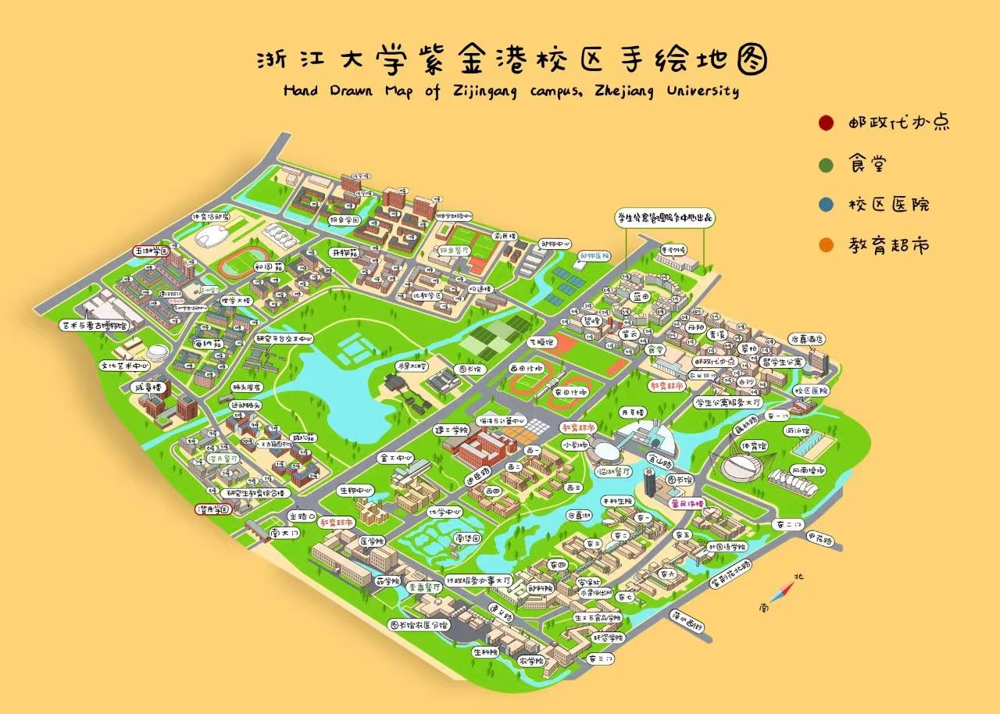
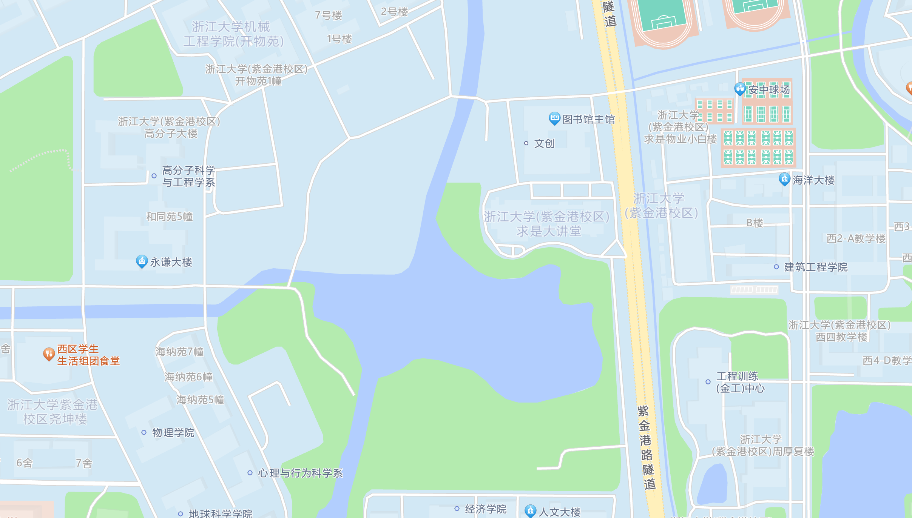
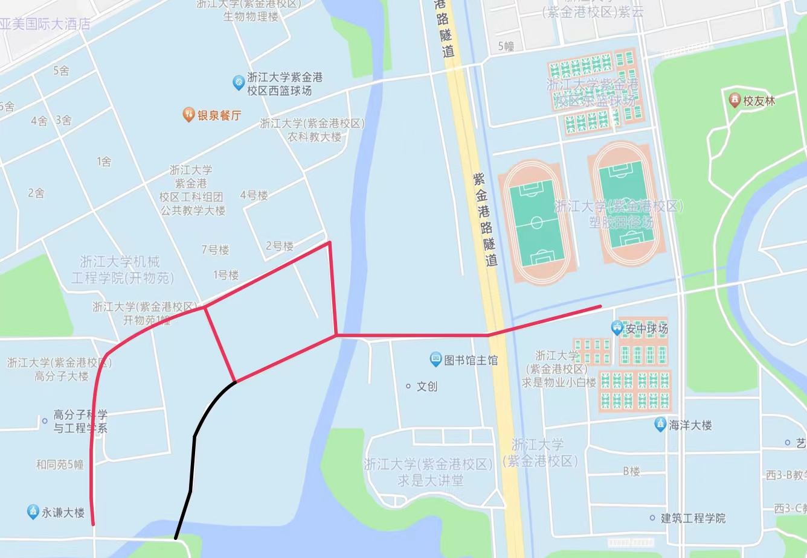
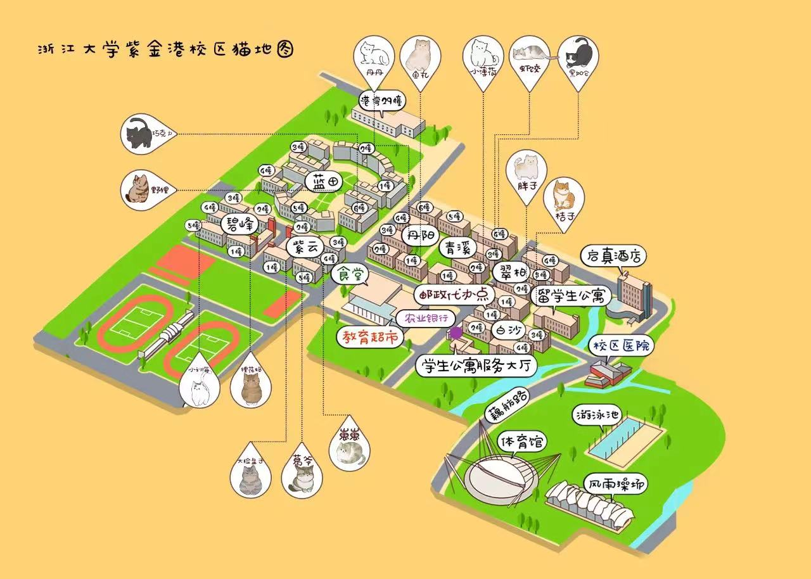

# 校园生活指南

!!! abstract
    24 学长组编写的生活指南，由一年来的<del>精彩</del>大学生活总结出的相关内容。跟随着这份生活指南，共同探索我们的校园吧~

## 校内食堂

紫金港校区一共有 7 个食堂，分布在学校的各个角落，位置如下图所示：

简要评价一下，我校食堂不算好吃也不会很难吃，价格相较于商业餐厅便宜很多，在高校食堂里不算出彩。

不过初入求是园，探索一下各个食堂是一件新奇有趣的事。

以下均为学长回忆，食堂经常推陈出新，品控又不佳，事实可能有所出入，请谅解。

一些可能想了解的流程（省流部分）：

- 如何机器点单：在机器上点好菜品 → 按购物车 → 刷卡 → 拿小票（麻辣香锅会有小碟子） → 等待叫号 / 小碟子发出响声 → 拿取菜品 → 用餐；
- 如何领取微信订餐：浙大后勤公众号上的微信订餐下单，到点可以在麦斯威二楼饮料售卖旁边的收银机排队核验二维码领餐；
- 外卖送到哪里：宿舍——西三门外卖柜；北教——银泉外卖柜；东教——东二门。

### 玉湖食堂（西区食堂）

离宿舍楼最近的食堂，军训的十几天都需要在这个食堂吃饭，<del>曾在校园论坛上荣登最难吃食堂 TOP 1</del>。

一楼是最新开的，主要为东南亚风味自助、波奇饭和智能浇头面。东南亚风味自助为称重收费，菜品不错值得尝试，但目前来看种类较少且一直没有更新。

从电梯上去，左手边是风味区，点单制：在机器上点好菜品 → 按购物车 → 刷卡 → 拿小票（麻辣香锅会有小碟子）→ 等待叫号 / 小碟子发出响声 → 拿取菜品 → 用餐。有韩式拌饭、手擀面、水饺、麻辣香锅等可选，价格一般在 10 元 ~ 20 元。

右手边是直接拿取餐盘的形式，拿好后即可找阿姨结账，**注意：早餐的杯装豆浆要 2 块钱，碗装（未加糖，可自己加）的豆浆只要 5 毛。拿菜时最好看清标价，否则很容易被背刺。**

玉湖食堂周围有全家、古茗、瑞幸等。

### 澄月食堂（留学生食堂、留食）

旁边是留学生宿舍的食堂，一楼点单，独家菜品：米线 / 乌冬面，日式鸡排定食，西式甜品。另外还有部分中式套餐、麻辣香锅、炸串、馄饨和西餐选择。相比于玉湖食堂，大概是花稍微多一点的钱（15~30）吃稍微好吃一点的饭菜。

二楼自选，没怎么去过（也不太推荐去）。

三楼点餐制餐厅，图灵团建点。

澄月食堂周围有星巴克，一鸣，瑞幸（在文学大楼一楼）等。

### 麦香餐厅

位于医学图书馆旁边的小餐厅，特色菜品：鸡丝凉面。

总体来说菜品价格比较实惠，但是选择较为单一。

### 东二麦斯威餐厅

东二教学楼后面的食堂，一楼是阿姨打饭打菜的中餐，下课时间需要排很长的队，建议错峰就餐，比如 11:00 和 12:30 以后。

二楼偏西餐，<del>常被人诟病又贵又难吃</del>，有牛排（34 元）和海鲜意面，新出了凉皮（8 元，吃过一次后就不好吃了），推荐芝士肉酱焗饭（18 元），还有好看的小面包供应。

### 临湖餐厅

一楼是打饭中餐，最左边还有性价比很高的粉丝煲，二楼的临湖猪排、牛排、鱼排吊打麦斯威，还有碳烤鸡等好吃的套餐，新出的炒面自觉一般。

### 东区大食堂

东区大食堂主要有六个区域如下：

- **一楼：**主要为休闲餐厅和风味餐厅。休闲餐厅是快餐的形式，菜品相较于玉湖更加丰富和美味，但是菜品常年无创新，吃久了也存在厌倦的可能性，总体来说性价比不错。风味餐厅是档口的形式，有川菜，陕西风味等档口，选择较为多样。

- **二楼：**二楼有三个就餐区域，分别是民族餐厅，东区食堂和西区食堂。民族餐厅供应清真菜品，有鸡腿，牛肉面，烤包子，炒米粉等等。本人觉得味道不错，不过新疆的朋友对该餐厅评价一般。此外，在此就餐，会遇见许多外国留学生。

- **三楼：**类似于外面的饭店，点餐结账。浙大烤鸭是主打菜。总体来说餐品价格和味道与校外的饭店相比没有竞争力，唯一的优势可能是处于校内，比较方便。

### 银泉餐厅

银泉餐厅是个人心目中的白月光了，餐厅共三楼，分为六个区域。

- 一楼分为 A、B 区，主要是西餐，日式定食，粤式煲饭，还有饺子，部队锅等种种不一而足。各种都值得尝试，等大家入学后自己来探索。

- 二楼为速选、自选和西北风味。西北风味主要为一些西北的面品，手抓饭和烧烤。自选区和玉湖休闲类似，不建议。强推速选区，有拌粉、漏奶华、蒸菜、木桶饭，还有多种甜品和总有人在排队的网红烤鸭卷，上新比较快。

- 三楼为小乐惠和食天一隅，模式与饭店相同。小乐惠主打川菜，适合爱吃辣的同学团建。食天一隅环境比较好，菜品精致，但价格稍高。

总体来说，银泉的菜品形式比较多样，会有不时的更新，人均消费偏高。

在银泉餐厅周围还有古茗、肯德基、一鸣、小淮娘鸭血粉丝汤、罗森等店。

## 出行方式

日常通勤距离（单程）约为 2.5km，自测走路半小时（军训会带你们走的），自行车 15 分钟，电瓶车 10 分钟，如果绕路去操场跑步的话要更久，出行方式的选择有以下几种：

### 电瓶车（小龟）

比较推荐的出行方式，优点是速度快又省力，赶早八必备神器 (x)，缺点是开销大、电池寿命较短（1~2 年后容量下降很快），充电不方便。下图是宿舍附近的充电桩概况，充电桩可以在“尼普顿智慧生活”公众号上查询。

### 自行车

买一辆自己的自行车，可停放在宿舍楼旁边的地下车库。

优点就是可以保证通勤，毕竟是自己的车，相对于电动车没有充电的困扰，并且骑自行车也算是一种运动方式。缺点就是好质量的自行车价格较高，蹬起来比电瓶车累。（在此提醒：尽量不要在校内安琪儿买车，质量堪忧，一分钱一分货）

### 共享单车

学校中有哈喽、青桔和美团的共享单车，买张长时间的卡肯定比自己买车省钱，而且无需担心找不到自己的车以及车的保养问题。缺点是某些特定地点和时间找不到车，尤其是每天早上九点五十之后，上课喜欢踩点的同学可能会较难找到合适的车辆，且车的质量可能较差。教学楼附近的车一般比较多。

### 小白车 / 校园巴士

小白车（以及新增的校园巴士）的路线以及实时位置可以在“浙大后勤”公众号的“班车查询”中查到，覆盖了日常的通勤路线，优点就是风雨无阻，冷热皆宜，速度快，缺点是下雨天或者起晚了排队需要较长时间。校园巴士与小白统一调度，但跟小白相比有空调，夏天坐这个要比坐小白舒服得多，在冬季以及雨雪天也会比坐小白更舒适，不过也有同学认为坐校园巴士容易晕车且车内空气不好。

宿舍与东教的站点分别为“西区生活组团”（玉湖食堂电梯门口上下车）和“东教学楼”（东一教学楼对面上下车）。

### 行走 / 跑步

21 学长组的一位学长坚持了两年，如果希望多走路锻炼，愿意早起出门上课的同学可以尝试走路上课。

???+ general "P.S."
    西区到东区有三条路线，一般常用的是南侧经过留食（留学生食堂，又称西区文科生活组团）、医学院的路线，这条路线流量较大、交通比较复杂；第二条路线则是北侧抵达云峰学园的路线；第三条是最近新修建的“中间路线”（求是路），途经求是大讲堂北面，现在已经修建的差不多了，可以骑自行车或小龟，应该是从宿舍到东区操场的最短路线，不过有段没有路灯的小路，晚上还是有点黑灯瞎火的（。
    
    **一般常用南路线**，是因为如果目的地是教室的话，南路线离东、西教学楼都更近，而且可以避开同样需要教室通勤的三大学园（蓝田、云峰、丹青）的人流，往往更快。
    
    如果目的地是大食堂或三大学园的话，**北路线**可能会是更好的选择。经过某学长测试，自行车走北路线抵达云峰只需要大概五六分钟，而南路线这个时间只能抵达西教甚至医学院。另外，北路线人流量较小，往往甚至可以飙车，而南路线交通情况复杂，往往需要限制速度，遇到乱走的行人或乱开的车也比较危险。
    
    新修的“中间路线”优势基本体现在到田径场的路程较短，此外，到西教学区、东区大食堂与银泉组团也能减短一定距离。此外这条路还有若干个比较陡的坡，骑车时请注意安全。
    
    另外，**雨天非常不建议骑车**，安全隐患很大，一定要予以重视（23 级图灵班开学不到 3 个月，骑车摔跤至少 18 人次）。特别是**风大**的时候（杭州这鬼天气经常这样），**千万不要骑车打伞**。即使不是雨天，也千万要注意交通安全，留心路面状况（去年有不少同学刚来的时候因为不熟悉路况而摔伤）。同时避免和别人发生交通事故，如果别人不太友好的话真的很麻烦，有的狠人动不动就把人挂朵朵，搞舆论战就算占理也很闹心。（如果不知道什么是朵朵，参见生活向之[浙大校园论坛有哪些](../qa/#q_34)）

## 住宿

竺可桢学院（含求是科学班和强基计划班）同学的宿舍均在西区玉湖宿舍，上床下桌，条件是全浙大最好的（2020 年投入使用），有独立卫生间，床宽 190x85 （注意与东区宿舍不同）。其中女生在六幢，男生在七幢，两栋楼大门正对，除一楼外中间有密码门连接。男生和女生可以进入对方寝室楼的一楼大厅（参加例会、讨论课程任务等），但原则上不允许上楼。关于西区宿舍环境，可以参见 B 站视频：[BV19V411v7FV](https://www.bilibili.com/video/BV19V411v7FV)。

关于寝室的分配问题，整体而言是随机分配，并且 1-4 号床位也是随机分配的，如果想要调整床位需要和室友商议并且联系宿管，更换寝室要与辅导员联系。当然会依据届时开放迎新功能时各位同学选择的 11:30 前 / 后睡眠以及是否抽烟、是否需要安装空调等问题分配寝室。当然实际上后两个问题基本无效，第一个问题实际执行时由于大学生活的特点选择。11:30 前睡觉也不一定能保证 11:30 前入睡，当然建议本身是阳间作息 / 希望获得阳间作息不会打游戏到很晚的同学选择前者，可能打游戏到较晚或者本身作息可能偏后的同学选择后者。

寝室有熄灯断电制度，23:35 之后熄灯不断网，仅空调与厕所有供电，因此晚上充电之类的用电需求要及时安排好，可以按需购置充电台灯。

## 生活配套

### 吃喝玩乐

紫金港目前周围生活配套还是很完善的。

大的商场主要有西溪龙湖天街，西溪银泰，城西银泰，印象城等等。

除了西溪银泰还较为“冷清”，其它商场都比较繁华，离玉湖宿舍区最近的是西溪龙湖天街，从艺博馆的出口出去左转过桥即可见。

餐馆集中的区域主要有“堕落街”（龙宇街）和剑桥公馆。分别从东三门和东二门出，不远即可见，可从高德地图搜见。

具体美食探店评价可移步正在建设中的 Turing Eating 网站~

### 医疗

- 买药：玉湖附近没有药店，平时推荐使用美团 / 饿了么买药送到外卖柜。
- 就诊：擦伤感冒等可去校医院，从东一门出即可见。如果是一些更高的需求，可前往杭州其他医院。
校医院一般就诊流程：大厅机器挂号（市民卡或医保电子凭证）→ 前往相应科室等待叫号 → 看病 → 大厅机器缴费 → 拿药

- 医保：杭州医保入校后即可办理，详见[新生医保文件](https://zdyy.zju.edu.cn/_upload/article/files/8d/a0/4fd8bb09446793d3d5d91b41cdf0/7e2c6905-ff51-4824-a48e-4cf77593c135.pdf)。需要注意的是，医保缴费周期按自然年计算，其中 2024 年剩余时间的医保缴纳是自愿选择的。如果医保未及时缴纳，可以拨打校医院医保办电话 88981591 登记补缴。更多详情参考[医保相关资料](https://zdyy.zju.edu.cn/2024/0710/c37585a2945012/page.htm)。

### 景点

杭州还是全国比较出名的旅游城市，:eyes: 看各自的兴趣，可以搜索攻略前往各大景点。

离紫金港比较近的是西溪湿地，个人认为值得一逛，是散步谈心的好地方。

在 cc98 的微信公众号上会有一些徒步的活动，感兴趣的同学可以关注一下（悲的是大多数在玉泉校区）

### 出行

地铁：从玉湖出发推荐蒋村地铁站，就位于龙湖天街旁边。若从东区出发，一般会选择虾龙圩，三坝或者浙大紫金港等地铁站。杭州地铁总体出行是比较方便的，基本覆盖了全市。

打车：从玉湖出发可以选择西三门，其他各个校门也很方便，在校内也可进行约车。

高铁站：杭州东站与杭州西站距离差不太多，坐地铁大概要一个半小时。不太建议杭州站（虽然离学校比较近但车次比较少，且比较老旧。杭州站在地铁的车站牌上叫城站。

机场：打车大概四十分钟，总价一百元左右，比较方便。推荐提前在朵朵或者98上约人一起出行，2-3人一起性价比较高。坐地铁到机场大概要一个半小时，而且很挤。

## 校内公共空间

校园内公共空间较多，下面根据不同的用途给出一些推荐，有待大家自己探索发现。

### 自习

- **主图：**作为最新建成开放的图书馆，配置新，环境好。二楼是可以通宵刷夜的区域，24 小时开放，考试周一般很满。座位均需预约，在公众号或图书馆网站提前预约或现场扫码预约均可（可惜预约系统经常崩）。主图优点多多，缺点是封闭环境中有些同学会觉得又闷又热，这一点因人而异。
- **北教：**北教的部分教室是自习教室，有大量座位，无需预约。由于离银泉餐厅 / 足球场很近，非常方便干饭 / 打卡。
- **方闻馆：**方闻馆位于玉湖宿舍对面的艺博馆二楼，最大的优点是离宿舍近。环境很不错，工作人员人也很好。规模较小的图书馆，座位不算多，无需预约直接坐。
- **东西教：**东西教长廊自习区（环境不如室内）、东二麦斯威或无课的教室（适合临时使用）

### 班团活动 / 例会

- **玉湖一楼：**A113/B113 周中通常用于各组织例会，其他导师室等也可以预约使用。
- **北教：**北教教室适合预约用于班会等。

### 小组研讨

- **主图研讨室、北教研讨室**（需要预约）
- **玉湖六、七幢大厅：**可用于小组讨论，每晚 22：30 清场。
- **玉湖宿舍沙龙区 / 研讨室：**比较容易遗忘的地点，可以利用起来。其中研讨室需要预约。

### 单人有声自习 / 线上面试

- 尧坤楼胶囊面试间（需要预约）
- 主图静音舱（缺点是需要站着且抢不到）
- 蒙民伟楼胶囊面试间（需要预约）

### 附：校内公共空间预约与使用指南

- **预约平台：**
    - 教学楼教室：[教学资源管理平台](https://jxzygl.zju.edu.cn)
    - 其他研讨室 / 活动室：[启真在线平台](https://qzonline.zju.edu.cn)
- **预约流程：**填写预约基本信息 → 填写指导老师（可填辅导员或相关负责老师，填谁谁审核） → 等待审核
- **使用说明：**审核通过后，无需打印申请表单，到现场直接拨打电子屏上的物业电话请保安开门，需出示预约成功信息。离开时，恢复桌椅，规范关灯关门。

## 校园道路

紫金港校区是我校最大的校区，校园道路方面对于新生不算很友好（尤其是住在玉湖）。但其实新生在开学期间所涉及到的较为陌生的地点大概只有海纳苑、北教学楼（也叫段永平教学楼）、小剧场、东教学楼这些位置。这里简单介绍一下从玉湖学园到这些位置的大致路线以及经过的主要建筑物，其他地方留给大家开学之后慢慢探索，<del>绝对不是因为我路痴</del>。

大家如果不太熟悉的话可以先开导航走几遍，基本走个两三遍就记住了。

### 玉湖-东教 (含玉湖-北教，玉湖-小剧场)

这里有多条道路选择，不过有一条是小路，比较陡峭，而且 2023-2024 春夏学期这条路在施工，不知道以后会不会继续投入使用，这里不放入这条。

- 玉湖 → 和同苑 → 开物苑 → **北教学区** → 碧峰紫云 → 东田径场 → 月牙楼、**小剧场** → 基础图书馆 → 东教学区
- 玉湖 → 成章楼 → 澄月餐厅 → 医学院 → 农生环组团 → 安保处 → 东教学区

还有一条道路，是从主图书馆前的道路走，在手绘的地图上没有标注出来，但是很常走的。这里截取了高德地图大家参考一下。(黑色路线是正在施工的部分，红色路线可以正常通行)

- 玉湖 → 海纳苑 → 和同苑 → (红色路线) → 东西田径场 → 月牙楼、小剧场 → 基础图书馆 → 东教学区

### 玉湖-西教

比到东教要近很多，西教学区植物种类丰富，春天景色很不错！就是蚊虫有点多，要做好防护工作（

- 玉湖 → 成章楼 → 澄月餐厅 → 医学院 → 迪臣路 → 西教学楼
- 玉湖 → 海纳苑 → 和同苑 → (红色路线) → 东西田径场 → 月牙楼、小剧场 → 西教学区

### 玉湖-体育馆

- 玉湖 → 和同苑 → 开物苑 → 北教学区 → 碧峰紫云 → 东田径场 → 月牙楼、小剧场 → 体育馆
- 玉湖 → 海纳苑 → 和同苑 → (红色路线) → 东西田径场 → 月牙楼、小剧场 → 体育馆

经常走的路线大概这些，其他校园道路校园建筑等问题可以参考[新生指引 > 校园区域](https://zjuers.com/welcome/life/campus/)。

### 彩蛋：猫猫学长/学姐一览

