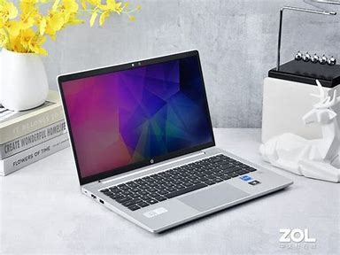
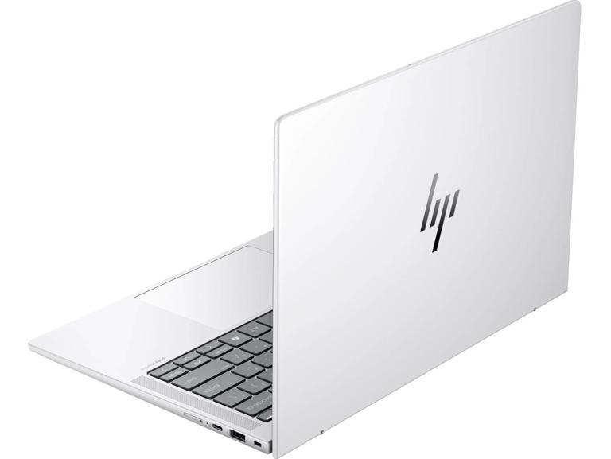
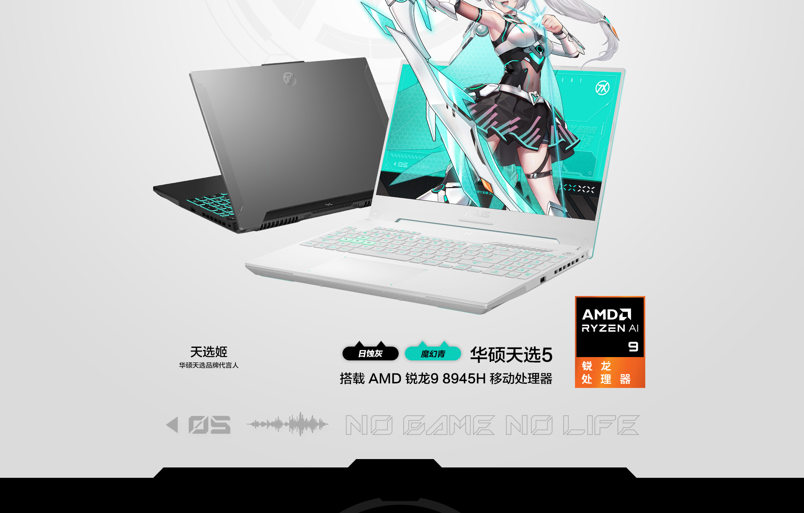
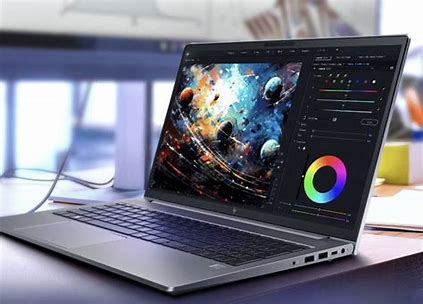

# 暑假购机推荐

!!! Note "温馨提示"
    - 本指南仅针对此前对电脑没有太多了解的同学，大神们可以忽略本篇文章
    - 本文不会涉及到 Apple 公司的任何设备，单纯因为本人没用过也用不起水果的产品，但 Mac 也是不错的选择，有意向购买 Mac 的同学可以在群里咨询使用 Mac 的学长
    - 垃圾佬或者希望采用某些奇怪方案的同学欢迎来交流
    - 不要信什么 AIPC 的鬼话，笔记本上面集成的 NPU 其实目前基本用不到，而且性能也非常羸弱。真想要 AIPC 的话，HGX H200 才叫 AIPC（暴论）
    - 如果愿意的话可以来问问，我可以给一些更详细的参考
    - 附上 E 志的[购机指南（上）](https://mp.weixin.qq.com/s?__biz=MjM5OTk0NTg3Mg%3D%3D&mid=2649495468&idx=1&sn=24349d4bcdb92b78c14ab5cebd87d01c)和[购机指南（下）](https://mp.weixin.qq.com/s?__biz=MjM5OTk0NTg3Mg%3D%3D&mid=2649496031&idx=1&sn=73050d414af05bb1e0015f60f2e84547)
    - 牢牢记住一点：没有垃圾的产品，只有垃圾的价格！！！

## 写在前面的话

我想大多数看到这份指南的同学在此之前都不甚了解电脑（对计算机硬件已经有深刻理解的同学可以忽略本文）。很多同学在采购电脑方面可能会感到非常疑惑：计算机专业？图灵班？是不是需要一台性能非常非常强劲的计算机，要巨大的储存、内存，有一大堆核心的高速 CPU、还有性能非常强劲的显卡？现在 AI 非常火，是不是需要拿笔记本炼丹？大学学习过程中电脑的使用场景究竟是什么？看完本文相信能得到答案。

## 任务需求分析

- **使用场景** 大学中使用电脑的时候非常多，但是实际上基本对性能要求不高，多数情况下就是开个 vscode、开个 terminal 和挂一堆浏览器标签页，反倒是续航和重量是最应当被考虑的（相信没人会想背着好几公斤的电脑和板砖电源到处跑的吧，不会吧不会吧）。在学习上最吃性能的大概就是 vivado（你们写 FPGA 玩的时就知道了），但是它的多线程优化挺烂的，所以更多的核心对你的学习没啥用。
所以，对于不怎么打游戏（或者说不打 3A 游戏）的同学，需要的是一台稳定、轻便、续航好的轻薄本，对有较高游戏需求的同学来说，需要的是一台平衡性能、功耗、续航和重量的全能本（因此本人不推荐任何使用 HX 处理器的笔记本）

至于炼丹之类的事情，笔记本电脑显存最多也就 8GB，对于炼丹来说处于是基本不能用的情况（√）。真要炼丹的话实验室会给卡的（连卡都没有的话还是快逃吧）。想玩计算卡和高性能 CPU 的同学欢迎加入超算队（夹私货）

- **图形性能要求** 哪怕是对游戏性能有需求的同学，其实也不一定需要独立显卡。以本人正在使用的集成在 **Ryzen 9 7940HS** 上的 **Radeon 780M** 核显为例，其浮点计算能力已经达到了 **RTX 4060** 的一半，在玩 DCS World（一款非常吃性能的飞行模拟器），在 2K、画质全高的情况下也基本能玩。所以对于显卡方面不用太焦虑，不要自己给自己创造需求出来

- **CPU 性能需求** 总体来说，需要高 CPU 负载的场景并不多。如果你是游戏爱好者，那确实可能需要标压的 i7/R7 及以上的处理器，否则的话日常使用其实目前的在售处理器都能满足需求（所以我后面说那么多处理器的事情其实是希望大家买到的产品能对得起它的价格，而不是怕同学们性能不够用）

- **内存需求** 鉴于 Windows11 比较臃肿，16GB 内存可能会出现不太够用的情况。出于中远期使用规划的考虑，使用不可拆卸内存的同学最好还是一步到位买 32GB 的版本；使用可拆卸内存的可以在 16G/32G 之间选择。

- **硬盘需求** 512G 的硬盘有可能不是太够用，如果有第二个硬盘位的话可以之后来加，没有的话建议还是买 1T 的版本。或者考虑外接硬盘（虽然成本会偏高一些就是了）

- **扩展接口需求** 很多同学可能会对笔记本上的扩展接口感到迷茫，下面我将做个简单的介绍
    
    === "USB 接口"
        在物理规格上主要分为 Type-A 和 Type-C。Type-A 口受限于物理限制，一般都是工作在 5Gbps 的速率；主要用途是拿来插键鼠（bushi），一般有 1-2 个就足够了。C 口在速率上分为 5Gbps、10Gbps、20Gbps 和 40Gbps 的，其中最后一种又经常叫雷电4或者 USB4。由于传输速率较高，一般用作连接硬盘甚至外接显卡用。一般 1-2 个也够用了。有些 C 口有更多功能，支持 PD 充电和 DP 显示信号输出等功能。**注意，如果没有特殊的需求，其实不用太在意 USB 接口的传输速率，因为带宽瓶颈的使用场景很少，而且高速的 USB 设备价格也十分昂贵**
    === "显示接口"
        出于方便的需要，到中后期不少同学可能会需要外接屏幕。一般笔记本会带一个 HDMI 接口或者全功能 C 口输出 DP 信号，一般来说能满足需求了。**注意，HDMI 协议和 DP 协议有不同版本，对传输速率会有影响，如果对外接屏幕分辨率和帧率有非常极致需求的同学需要注意**
    === "有线网口"
        emmm 这个看个人。不少同学大概是没有连接有线网的需求的。没有网口也可以用扩展坞外接，不用太担心。不过我个人还是喜欢带网口的    

同时应当注意到的是，很多厂商在宣传时非常喜欢宣称自己的性能释放有多么强劲。但在目前的工艺下，所谓更高的性能释放其实并没有实际的意义。4060 在 105w 和 140w 的功耗下对比起来，其性能表现其实并没有多大差异。盲目提升功耗除了让你电脑的噪音更大和更加烫手、寿命更短之外其实并没有多大意义。

## 部分产品推荐
!!! Warning "警告"
    产品推荐仅在个人在实际使用和认识的基础上给出，不一定能全面反映产品实际情况。出于负责任的考虑，推荐型号均为主流厂商比较知名的产品，很多笔者没有深入了解甚至实机接触过的笔记本并没有出现在推荐列表里，并不代表其他型号一定具有可靠性或是价格方面的问题（已知有大坑的型号均会被提到）。具体不同配置究竟如何请结合“前置知识”部分和自身任务需求进行综合判断

!!! Note "前置知识"
    - 目前市面上笔记本的 CPU 主要是由 AMD 和 Intel 两个厂家生产的。虽然 AMD 在普通人中的知名度相对低一些，但它的产品在现在已经非常成熟，甚至在很多续航、能耗、性价比等很多方面已经超过了 Intel，所以可以放心购买。**本人使用 AMD 处理器，同时推荐使用 AMD 处理器。**
    - 目前 CPU 型号辨别：
        - **AMD 7000 系列**：数字编号共 4 位，第一位是对应 7000 系列的 7；第二位对应同架构内型号区别，不用过分在意；最后两位代表处理器微架构：20 对应 Zen2（对没错很老的一个架构，最近还出了个 refresh 版本，所以要防止上当受骗），30 对应 Zen3（也比较老了），35 对应 Zen3+，40/45 对应 Zen4。例如，笔者使用的处理器编号为 Ryzen 9 7940HS 表明处理器使用的是 Zen4 微架构。**注意 R7 和 R9 很多时候在规格上是一样的，但是 R9 会有溢价，请留意**。编号后边的字母的代表功耗。U 为低功耗系列，热设计功耗 15w；H/HS 为标压系列，热设计功耗为 45/55W（**注意：H 和 HS 没有实质性区别，实际功耗释放由笔记本厂商设置，不用纠结是 H 还是 HS**）。值得注意的是，HX 系列为桌面端移植，采用了分离式 IOD 的设计，在增大了 L3 cache 的同时提高了功耗，降低了续航。**出于平衡的考虑，笔者不推荐在笔记本上使用 HX 处理器**。
        - **AMD 8000 系列**：没什么好说的，就是 7000 系列的马甲，对应着看就行。
        - **Intel 12-13 代**：本质上都是一个架构（牙膏厂是这样的）。由于使用了性能-能效核的设计，处理器编号非常混乱，i3/5/7/9 其实不再具备参考意义，**建议在 Intel ark 上面查找相应的处理器信息，或者在购买时向客服/销售明确问清楚：你们这台电脑的处理器有几个 P-core（性能核），几个 E-core（能效核），不要拿几核或者 i 几来打哈哈！！** 至于编号的数字方面，Intel 多了一个 P 的分类，对应 28w 的热设计功耗，例如 Intel Core i5-1240P。
        - **Intel 14 代（即 Core Ultra，基于 Meteor Lake 微架构）**：Intel 最新的移动端处理器，大幅度提升了核显的性能，同时使用更新的工艺优化了续航。但 CPU 微架构上提升不是很大，价格上倒是提升了不少。建议预算较为充足的同学考虑。命名上延续了 12-13 代的传统，还是建议问清楚 P/E 核的数量。（注意，14 代加入了 2 颗 LPE 核心，主要是用来待机用的，计算性能的时候一般不将其考虑在内）

    !!! Danger "注意"
        **Intel 的 13/14 代处理器最近爆出重大工艺缺陷，可能导致大量处理器出现严重的故障。Intel 官方目前没有给出说法，但是就实际情况来看可能会波及大量 SKU，在选购时请谨慎！**

!!! Note "省流"
    - 要极致的核显性能：AMD 的 Zen3+、Zen4，Intel 的 14 代（注意问清楚核显是多少 CU / EU / 流处理器的，因为不少处理器会屏蔽一部分流处理器，要极致性能的话 AMD 推荐 12CU RDNA2/3（768 流处理器），Intel 推荐 128EU Xe（1024 流处理器），要求不高的不用太在意这个）
    - 要极致的续航：AMD 的 Zen3+、Zen4，Intel 的 14 代
    - 要极致的性能：AMD 的 Zen4，Intel 的 14 代或者两家的 HX 系列处理器
    - 要极致的性价比：AMD 的 Zen3+、Zen4（这个得看具体笔记本定价），Intel 的 12 代 P/H 系列

### 轻薄本

!!! Note "提醒"
    - 如果你没有什么游戏需求，也不太在意性价比，但是比较在意笔记本的外观和轻便，那么华为的笔记本可能比较适合你，否则的话就一点也不推荐了
    - 机械革命的笔记本虽然性价比总体较高，但据说最新出厂的大多数产品的硬盘均变成了用 QLC 颗粒的（一种价格低但是性能差寿命短的固态硬盘），选购时应当预见到可能存在的风险。
    - Dell 在业内有“人傻钱多戴”的外号，产品价格很贵，品控之前还算不错（现在怎么样我就不知道咯）但是这两年 Dell 在加速迁离中国市场，所以不太推荐购买 Dell 的笔记本

#### 惠普

- **战 66 七代锐龙版** 胜在便宜且可靠，战 66 七代锐龙版价格总体来说也还算便宜，如果允许的话可以考虑直接上 Ryzen 7 7735U 的版本（据说 Zen3+ 的续航表现其实比 Zen4 好，反正我 Zen4 的体验是 uncore 功耗居高不下），续航、轻便、外观很不错，总的来说是值得购买的。
  

- **战 X** 定位比战 66 稍高，价格自然也更贵一些，但是有着更强的扩展性、更精细的做工和更强的续航。在意这些的同学可以优先考虑购买。
  

#### 联想

- **小新 14/16** emmm 虽然之前小新系列出过低温锡风波，但是最近两年貌似品控有所改善，周围用的人也还是不少，可以考虑考虑。

- **Thinkbook 14+/16+** 联想商务系列中性价比比较高的一款，我在朋友手里试过这款机器，做工还是很不错的，定位介于小新和ThinkPad之间，价格可能稍微贵一点点，但也可以考虑购买。
  

#### 华硕

- **灵耀 14/16** 感觉比较贵，产品应该还是挺不错的，追求体验的同学可以考虑。

#### 荣耀

- **MagicBook 系列** 本人没有实际体验过荣耀的笔记本，但看测试续航得益于优秀的调校相当不错，而且性价非常高，外观上也非常优秀。在意这些的同学可以优先考虑。

### 全能本

#### 华硕

- **天选 5/5Pro** 虽然天选一直都会有些小毛病，但是在续航和性价比这块还是相当不错的（哦或许还有白色款的颜值）。网卡叠叠乐的问题貌似在天选 4 上已经做了改进，至少本人没出现掉网卡的情况，但是在使用过程中需要小心后盖螺丝松动乃至脱落的情况（我就是受害者）。重量控制的也不错。推荐锐龙版。
  

#### 联想

- **拯救者** 拯救者一直都有一堆子型号，说实话我也不太清楚（bushi）。总体来说评价比较一致的好，也相当的出名，注意不同子型号的价格就行（当然续航听说不算特别好）

#### 惠普

（由于黑屏精灵的事情闹得沸沸扬扬的而且惠普还装死，所以我在这里推荐它的移动工作站）

- **战 99 锐龙版** 非常离谱的事情是，AMD 比 Intel 性价比高了非常多。这款工作站续航非常好，外观非常非常好看（我当时就想买它的呜呜呜......这可是工作站！！），但是功耗释放较低，介意的同学慎选。鉴于大多数同学大概是不需要 ISV 认证带来的那堆奇奇怪怪应用的 buff，所以建议是选择核显版本或者 4050 版本。不太推荐使用专业卡的版本。
  

!!! Note "使用建议"
    - 如果想开盖更换内存和硬盘的话，建议提前了解厂家保修策略。部分厂家可能会出现自行开后盖后不给保修的情况。
    - 对笔记本进行任何板级操作时都应当做好防护措施，避免发生短路或静电击穿事件造成不必要的财产损失甚至人身伤害。
    - 如果笔记本自带的是板砖式的电源，可以考虑买一个 65w-130w 的 GaN 的 PD 协议充电器（现在的笔记本基本普及了 C 口的 PD 充电），能让你携带笔记本外出时更加轻松。
    - 如果笔记本出现故障，一定谨慎到所谓的官方线下维修点去维修，基本上就是坑钱的。建议了解市场价格之后再综合研判，选择合适的维修渠道。
    - **续航调优：**最简单的办法是在 Windows 的电源计划中将离电模式下的“处理器最大状态”调低（处理器工作频率 = 处理器基准工作频率 * 处理器最大状态，一般调低到 1.6GHz 是比较平衡的一个点），可以有效地提升续航时长。
