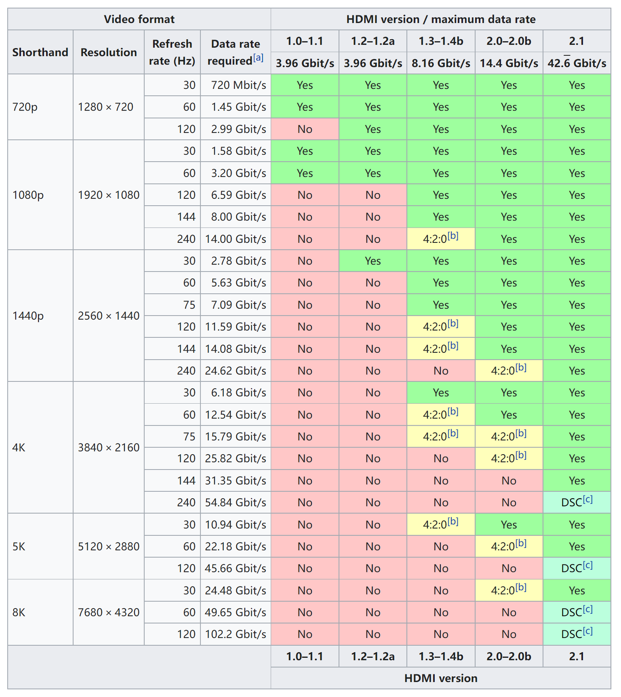

# 暑假购机推荐

!!! Note "温馨提示"
    - 本指南仅针对此前对电脑没有太多了解的同学，大神们可以忽略本篇文章
    - 垃圾佬或者希望采用某些奇怪方案的同学欢迎来交流
    - 如果你说在的地域无法使用国家补贴的话，可以考虑来杭州后使用浙江国补进行购机，目前很多机型的价格都是为了吃国补定的，不使用国补性价比相对较低。
    - 如果愿意的话可以来问问，我可以给一些更详细的参考
    - 部分机型具体情况可以参考笔吧评测室的[618购机指南](https://www.bilibili.com/video/BV1JBjhz1E6D/?spm_id_from=333.1365.list.card_archive.click&vd_source=c3be43d3946b30dd75f3aee388f5e04a),不过视频相对有点古早了。
    - 牢牢记住一点：没有垃圾的产品，只有垃圾的价格！！！
    - 如果你不希望面临难以解决的问题的话，请不要购买华为旗下搭载非Intel/AMD处理器的笔记本电脑，包括那个看起来很炫的折叠屏笔记本。
    - 一般不建议线下购买电脑，线上价格往往更低且配置更加透明。

## 写在前面的话

我相信部分同学对于电脑的需求并非仅仅是在学习上的，而是附带有娱乐的需求。其实在大学中，除了游戏外大部分的使用场景并不需要太高的性能，大部分电脑都能够满足需求。如果你确定自己不会打游戏，或者说不会打大型游戏，一台**轻薄本**足矣，现在的核显机型的集成显卡性能大多不错，轻度的游戏完全能够胜任；而如果你想畅玩大作的话，就需要一台性能更加强劲的**全能本**（或者是**轻薄本+主机**的方案）；同时鉴于从玉湖宿舍到东区教学区的通勤距离相对较远，续航和重量也是需要考虑的因素。因此如果预算有限的话，很难说存在一个完美的方案，所以本文将会从使用场景和需求出发，给出一些建议和推荐来供大家权衡。

## 任务需求分析（Windows本）

- **使用场景** 大学中使用电脑的时候非常多，但是实际上基本对性能要求不高，多数情况下就是开个 vscode、开个 terminal 和挂一堆浏览器标签页，反倒是续航和重量是最应当被考虑的（相信没人会想背着好几公斤的电脑和板砖电源到处跑的吧）。在学习上最吃性能的大概就是 vivado（你们写 FPGA 玩的时就知道了），但是它的多线程优化挺烂的，所以更多的核心对你的学习没啥用。
所以，对于不怎么打游戏（或者说不打 3A 游戏）的同学，需要的是一台稳定、轻便、续航好的轻薄本，对有较高游戏需求的同学来说，需要的是一台平衡性能、功耗、续航和重量的全能本（因此本人不推荐任何使用 HX 处理器的笔记本）

至于炼丹之类的事情，笔记本电脑显存最多也就 8GB，对于炼丹来说处于是基本不能用的情况（√）。真要炼丹的话实验室会给卡的（连卡都没有的话还是快逃吧）。想玩计算卡和高性能 CPU 的同学欢迎加入超算队（夹私货）。

- **图形性能要求** 如同前文所提到的，除非需要玩大型游戏，否则其实对图形性能的要求并不高。现在的CPU的集成的核显已经足够满足大多数同学的需求了。如果刚需独立显卡的话，需要注意50系显卡实际上根据封装(强关联着性能、功耗)分成了两个档次：BD2的主流甜点卡RTX 5050/5060/5070三张卡、BD1的旗舰/次旗舰显卡RTX 5070Ti/5080/5090，5070Ti和5070看似只差了个尾缀，但实际的性能差距还是比较大的，而5060和5070的差距实际上并不大，对于这三个主流价位的显卡配置，需要仔细考虑。同时50系相对40系的代际提升没有很大，如果预算吃紧的话选择40系显卡也不失为一个不错的选择，50系显卡独占的1插3功能在原始帧率低的情况下并不能发挥出很好的效果，因此没有必要硬上甜品级的50系显卡。

- **CPU 性能需求** 总体来说，日常使用中需要高 CPU 负载的场景并不多。如果你需要玩大型单机游戏，那么一般来说显卡性能对于游戏帧率的影响更大一些，CPU只要是N-1或N-2代（N-1代指上一代，N-2代指上上一代）的主流标压处理器就足够了。如果你需要玩大型网游，比较吃的是 CPU 的单核性能，这时候选择最新一代的CPU确实会有更好的体验，但是如果你追求极致的帧率，可以选择AMD家带3D V-Cache的处理器，虽然目前国内在售的移动端CPU中只有Ryzen 9 9955HX3D这一个选择，并且价格相对较高。此外，如果你有视频剪辑的需求的话，Intel的CPU有着更好的硬件加速支持，对比AMD的处理器，在同一张显卡的情况下，视频处理速度上会快上不少。如果刚需Windows并且不需要太强悍的性能，这里十分推荐Intel Lunar Lake的酷睿Ultra 200V系列，续航比肩Mac，且核显性能优秀。
- **内存需求** 鉴于 Windows11 比较臃肿，16GB 内存可能会出现不太够用的情况。出于中远期使用规划的考虑，使用不可拆卸内存的同学最好还是一步到位买 32GB 的版本；使用可拆卸内存的可以在 16G/32G 之间选择，动手能力强的可以买16GB的版本自行进行更换（但一定要规范断电操作）。

- **硬盘需求** 512G 的硬盘大概率是不太够用的（对于windows本来说），如果有第二个硬盘位的话可以之后来加，没有的话建议还是买 1T 的版本，如果有玩各种大型游戏的需求更建议上2T的，反复删载游戏在学校网络的小水管下并不是很好的体验。

- **扩展接口需求** 很多同学可能会对笔记本上的扩展接口感到迷茫，下面我将做个简单的介绍
    
    === "USB 接口"
        在物理规格上主要分为 Type-A 和 Type-C。Type-A 口受限于物理限制，一般都是工作在 5Gbps 的速率；主要用途是拿来插键鼠（bushi），一般有 1-2 个就足够了，需要注意的是，5Gbps的USB3.0接口使用的频率范围接近2.4GHz，会产生一定的电磁干扰，影响2.4GHz无线设备的使用，<del>所以马枪的时候可以多一个理由</del>。C 口时至今日依然没能够完成统一大业，不同设备的C口支持的传输速率和充电速率大不相同，传输速率从5～120Gbps不等，供电功率最高可至140W。对于2025的大部分笔记本来说，至少有一个C口是支持USB4协议以及PD充电协议以及DP视频输出功能，即所谓的全功能C口，但对于Thunderbolt协议的支持基本只出现在中高端机型上，原因是支持Thunderbolt的C口约需要x4的PCI-E通道，各方面成本较高，但速率高甚至能作外接显卡用。对于支持PD充电的C口，可以直接使用支持PD协议的充电器进行供电，如果使用GaN充电头来进行供电就可以只带一个小充电头和一条支持大电流的充电线通勤，降低通勤负重。对于C口的视频输出支持需要了注意不同C口的视频输出通道可能不同，有可能一个口是核显输出，一个口是独显输出，会对外接显示器时调用的显卡产生影响。**注意，如果没有特殊的需求，其实不用太在意 USB 接口的传输速率，因为带宽瓶颈的使用场景很少，大部分场景是碰不到的，而且高速的 USB 设备价格也十分昂贵，但是在2025年如果一台笔记本没有全功能的C口，那么这台笔记本的模具大概是不值得你为它买单的**
    === "显示接口"
        出于方便的需要，到中后期不少同学可能会需要外接屏幕。一般笔记本会带一个 HDMI 接口或者全功能 C 口输出 DP 信号，一般来说能满足需求了。**注意，HDMI 协议和 DP 协议有不同版本，对传输速率会有影响，很多屏幕甚至于笔记本的HDMI接口只支持HDMI1.4或HDMI2.0，分别不能够满血支持2K高刷和4k高刷，具体支持情况可以看下图的表格**
        
        
    === "有线网口"
        很多轻薄本为了轻薄都把RJ45网口给去掉了或者做成了折叠式的，大部分都不会有这方面需求的，再不行也能上拓展坞，因此不会有太大影响。   

## 任务需求分析（Mac）

- **使用场景** 与前面所说的 Windows 本类似，Mac在转向Apple Silicon 之后，性能和续航都有了质的飞跃，基本可以在大多数情况下可以不充电满足一整天的使用需求，如果不行再加一个20000mAh的支持PD协议的充电宝也一定行。Mac的触控板也是笔记本领域的顶尖水平，在熟练使用的情况下确实可以不用携带鼠标，因此可以极大的减轻通勤负重。Mac的系统生态也相当完善，很多软件都有对应的版本，甚至有些软件在Mac上运行的更好（例如JetBrains家的IDE），同时Mac的Unix环境与Linux环境类似，同时还有homebrew这样的包管理器可以使用，开发体验个人感觉要比Windows好。不足之处在于vivado、游戏和PTA（浙大的线上OJ和考试平台）了，vivado可以利用Rosetta2转译下的Linux版本运行，虽然性能会有一定损失，但并非完全不能跑，游戏可以要靠Apple Arcade发力了，毕竟2077马上也要上Apple Arcade了，也可以用CrossOver这样的软件（可能会有一定的bug），PTA的话如果cyll不更新一下就完全无解了，只能借用别人的windows笔记本了。最后提一嘴国补，国补让Macbook Air的起步价到了5000元这个价位，作为一个高端的轻薄本，Mac的性价比还是很高的。

- **图形性能要求** M3之后的芯片在GPU 3D性能上有了很大的进步，由于统一内存带来的带宽和可用显存量带来的优势，M系列芯片在图形性能上已经可以满足大部分同学的需求了，16G内存的M3甚至能够渲染导出台式机4070无法顺利渲染blender项目。并且由于媒体引擎在视频处理上的加速，M系列芯片在视频处理上也有着非常好的表现。即使是深度学习相关的项目，由于Pytorch对MPS的支持已经非常完善，M系列芯片也可以胜任部分深度学习推理任务的加速，项目迁移到Mac上也只需要加一两行代码。

- **CPU 性能需求** M系列芯片的CPU性能在轻薄本中已经是顶尖水平了，单核性能甚至超过了部分的桌面端处理器，多核性能也可以满足绝大部分的需求，因此对于大部分同学来说，M系列芯片的CPU性能是足够的。对于有特殊需求的同学来说，Pro和Max版本的芯片在多核性能上有着更好的表现。

- **内存需求** 去年苹果的究极被刺过后，Mac的内存已经从16G起步了，16G内存对于Mac的内存管理来说在大部分情况下都是足够的，你可以开几十个浏览器窗口的同时挂一堆程序在后台，甚至与能跑Q4量化后的14b大模型，如果你有更高的需求，32G内存的版本也可以满足大部分的需求，如果你有超过32G的需求，就必须加钱买Macbook Pro了。需要注意的是，Mac的内存是不可拆卸的，无法加装，因此在购买时需要考虑好未来的使用需求，需要注意的是16GB的内存会导致内存压力长期较大，导致频繁读写交换分区，一定程度上会影响硬盘寿命。

- **硬盘需求** MacOS下垃圾文件不多，但起步的256G硬盘还是有点小的，省着用可能够用，但建议最少上512G的版本。如果你不想买苹果的金子硬盘，也可以选择外接硬盘的方案，Mac的接口速率都不低，用起来除了麻烦些之外没有什么问题。最后如果Mac过保了之后，也是可以选择找人更换硬盘的，虽然价格不便宜，但比起苹果的金子硬盘还是便宜不少。

- **扩展接口需求** Mac自带的接口有且仅有USB-C接口和3.5mm耳机接口，USB-C接口支持Thunderbolt 4和PD充电协议，支持外接显示器和高速数据传输，同时支持PD充电协议，如果你需要其他借口就必须要买拓展坞，不过如果不是对速率有要求可以不用买Thunderbolt拓展坞，直接买个USB-C的拓展坞就行了，前者的价格还是蛮贵的。不得不提一下的是3.5mm耳机接口，Mac的3.5mm耳机接口支持高阻抗耳机输出，推理非常猛，甚至可以直接驱动一些高阻抗的耳机和难推的耳机，某种程度上可以省一个台放。

## 部分产品推荐
!!! Warning "警告"
    **以下笔记本价位分类均基于国补后的价格**。
!!! Warning "警告"   
    本人并没有真正使用过以下产品，配置上比较明显的优缺点会写出来，但是具体是否适合各位同学，建议上网看看实机测评后在做决定，以下推荐仅供参考，还有很多好机型等待各位同学去发掘。

!!! Note "前置知识"
    - 目前市面上笔记本的 CPU 主要是由 AMD 和 Intel 两个厂家生产的，(当然也有开先和华为麒麟之类的信创产品，但对于CS学习来说可用性不高)。一般而言同模具笔记本Intel机型往往会比AMD机型更贵一些，但除去视频剪辑方面的劣势，AMD的处理器的性能Intel相比并没有明显区别，因此选择AMD的机型一般而言是一个根据性价比的选择。
    - 目前主流 CPU 型号辨别：
        - **Apple Silicon M系列处理器**：Apple Silicon M 系列处理器的命名方式比较简单,M后面跟着的数字就是处理器的代数，数字后面的字母代表处理器的版本，Pro、Max、Ultra分别代表中高端、高端和旗舰版本，不过Ultra并没有移动端产品。M3是M系列处理器的一个分水岭，其3D图形能力得到了飞跃，渲染特性从移动端转向了桌面端，往后的代际提升都在10%～20%之间。需要注意的是，M系列处理器的内存采用片上内存，不可更换的，因此在购买时需要考虑好未来的使用需求。另外采用M系列处理器的Mac只能运行MacOS系统，并且由于架构原因，即使使用虚拟机，也需要使用Rosetta2转译CPU指令，才能运行x86架构的Linux/Windows系统，性能上会有一定损失。并且目前很多游戏并不原生适配MacOS，非要玩的话需要使用GPTK转译GPU指令，也会有性能损失。
        - **AMD Ryzen 7000/8000/9000 系列**：数字编号共 4 位，第一位是对应 7000/8000/9000 系列的 7/8/9；第二位对应同架构内型号区别，不用过分在意；最后两位代表处理器微架构：20 对应 Zen2（对没错很老的一个架构，最近还出了个 refresh 版本，所以要防止上当受骗），30 对应 Zen3（也比较老了），35 对应 Zen3+，40/45 对应 Zen4。例如，笔者使用的处理器编号为 Ryzen 9 7940HS 表明处理器使用的是 Zen4 微架构。9000系目前只有三款HX系列的处理器，均为Zen5架构。**注意 R7 和 R9 很多时候在规格上是一样的，但是 R9 会有溢价，请留意**。编号后边的字母的代表功耗。U 为低功耗系列，热设计功耗 15w；H/HS 为标压系列，热设计功耗为 45/55W（**注意：H 和 HS 没有实质性区别，实际功耗释放由笔记本厂商设置，不用纠结是 H 还是 HS**）。值得注意的是，HX 系列为桌面端移植，采用了分离式 IOD 的设计，在增大了 L3 cache 的同时提高了功耗，降低了续航。**出于平衡的考虑，不推荐在笔记本上使用 HX 处理器**。
        - **AMD Ryzen 200/H 200系列**：该系列就是上代锐龙7000\8000H、U系列的马甲，只是取消了H、U的后缀，典型特征是中低U中显。对标酷睿200H、U系列，即13代酷睿的马甲。
        - **AMD Ryzen AI 300/AI H 300系列**：锐龙8000H、U系列的迭代升级，对标的是Ultra 200H、U系列，典型特征是中U高显，均采用Zen5架构，但采用了大小核核设计，大核采用Zen5架构，小核采用Zen5c架构，Zen 5c核心架构和Zen 5一样，只是削减了三级缓存、降低了频率，命名中的AI是指CPU搭载了基于XDNA 2架构的NPU的，AI算力超过50 TOPS，但到目前为止并没有什么用，不需要太在意。
        - **AMD Ryzen AI MAX 300**：强U强显，约等于9955HX+5060的水准，得益于统一内存设计，显存可动态分配48G（64G内存版本）或96G（128G内存版本），即使部署70B大模型，也是够用，但是应该没什么人会用到。但是国内据我所知笔记本中只有ROG 幻X 2025搭载了该系列中的AI MAX+ 395处理器，价格很高，性能释放一般，性价比较差，不推荐。
        - **Intel 13\14 代HX系列和/酷睿Ultra 200HX系列**：定位：高功耗、高性能、续航差，酷睿Ultra 200HX其实就是15代HX系列，这一系列的处理器和桌面端是同一颗DIE但进行了降压和限制功耗的处理，不用太担心出现桌面端的“肛缩”现象。
        - **Intel 酷睿200H系列**：Intel 13代H系列的refresh马甲版本，注意是不带Ultra的，能耗比比较一般，不建议购买。
        - **Intel 酷睿Ultra 100H系列/酷睿Ultra 200H系列**：定位：中高功耗、中高性能、续航较好，世界上分别对应14、15代的H系列。Ultra 200H系列是Ultra 100H的迭代新产品，用了新架构，对比100H全方面提升了一些，，会采用在今年各大主力轻薄本上。
        - **Intel 酷睿Ultra 200V系列**：采用类似于Apple M系列芯片的架构，性能和续航在低功耗处理器中处于十分优秀的水准，核显规模较高，续航优秀，配合Windows阵营的大电池，可以做到比肩设置超过Mac的续航。Ultra 200V系列全系均为片上内存，不可更换，最后一位数字为6的是16gb内存，8结尾为32GB内存。由于理论上是去年的产品，今年购买的性价比不错
        - **Intel 酷睿Ultra 100U/200U系列**：马甲系列，国内似乎几乎没有相关产品，可以忽略。

!!! Note "省流"
    - 要较好的核显性能：AMD 的 Zen3+、Zen4，Intel 酷睿Ultra 200V系列、酷睿Ultra 100H系列/酷睿Ultra 200H系列（注意问清楚核显是多少 CU / EU / 流处理器的，因为不少处理器会屏蔽一部分流处理器，要极致性能的话 AMD 推荐 12CU RDNA3/4（768 流处理器），Intel 推荐 128EU Xe（1024 流处理器），要求不高的不用太在意这个）
    - 要极致的续航：Intel 酷睿 Ultra 200V 系列，Apple Silicon M 系列处理器。
    - 要极致的性能：AMD 的 Zen4\zen5，Intel 的 14代\Ultra 200的 HX 系列处理器
    - 要极致的性价比：AMD 的 Zen3+、Zen4（这个得看具体笔记本定价），Intel 的 13 代 HX 系列、Ultra 100H系列。

!!! Note "提醒"
    - 华为目前仍搭载x86处理器的笔记本电脑默认出场安装国产Linux系统，如果需要使用其他系统需要自行安装，需要一定动手能力。
    - 机械革命的笔记本虽然性价比总体较高，但最新出厂的大多数产品的硬盘均变成了用 QLC 颗粒的（一种价格低但是性能差寿命短的固态硬盘），选购时应当预见到可能存在的数据丢失风险。且这一品牌品控较差，之前还出现了BIOS问题，虽然总体来说问题不大，但选购的同学可能需要具备一定的动手能力。

### 3500以内

#### 联想 来酷Pro14
| 项目           | 参数说明                                      |
|----------------|-----------------------------------------------|
| **处理器**     | 锐龙 7 H 255 处理器                              |
| **内存**       | 32GB DDR5 5600MT/s 内存                            |
| **硬盘**       | 1TB 固态硬盘                                   |
| **屏幕**       | 14 英寸，2880 × 1800 分辨率，120Hz，100% sRGB，IPS |
| **电池容量**   | 80Wh                                          |
| **机身厚度**   | 17.8 ~ 18.5mm                                |
| **整机重量**   | 1.47kg                                       |
| **适配器重量** | 228g                                         |

【优势：一线品牌中性价比极高，扩展性好】

【劣势：噪音较大，屏幕未校色，触控板手感一般，网卡似乎一般】

没什么好说的，这个价位，能享受联想的保修，甚至搭载OCulink接口能外接显卡（价格不便宜），性价比一流，网卡问题自己换个其实不贵。

#### 机械革命 无界14 Air
| 项目           | 参数说明                                      |
|----------------|-----------------------------------------------|
| **处理器**     | R7 7735H 处理器                              |
| **内存**       | 16GB LPDDR 6400MT/s 内存                           |
| **硬盘**       | 1TB 固态硬盘                                   |
| **屏幕**       | 14.0英寸 2880×1800分辨率 100%sRGB色域 120Hz刷新率 IPS屏 |
| **电池容量**   |  60Wh                                          |
| **机身厚度**   | 14.8~15.7mm                                |
| **整机重量**   |  1.01kg                                      |
| **适配器重量** |  153g                                         |

【优势：超轻1kg，价格低廉】

【劣势：硬盘一般，续航一般，接口速率较低】

重量很轻，但代价是小电池带来的一般的续航，没有USB4接口，但C口支持PD充电和DP输出，其实也够用了，性价比之选。

### 3500——4500

#### 机械革命 蛟龙15Pro
| 项目           | 参数说明                                      |
|----------------|-----------------------------------------------|
| **处理器**     | R7 7435H 处理器                                  |
| **显卡**       | RTX 4060 8GB 独立显卡（140W）                            |
| **内存**       | 16GB DDR5 4800MT/s 内存                            |
| **硬盘**       | 512GB 固态硬盘                                   |
| **屏幕**       | 15.6英寸 2560×1440分辨率 100%sRGB色域 165Hz刷新率 IPS屏 |
| **电池容量**   | 62Wh                                          |
| **机身厚度**   | 19.8~23.9mm                               |
| **整机重量**   | 2.18kg                                      |
| **适配器重量** | 623g                                       |

【优势：性价比极高，性能释放较好，接口丰富】

【劣势：CPU较弱，键盘温度高，D壳塑料感重】

虽然是去年发布的笔记本，但配置不算差，放在今年性价比极高，适合有一定游戏需求但预算不高的同学。

#### 荣耀笔记本 X14 Plus
| 项目           | 参数说明                                      |
|----------------|-----------------------------------------------|
| **处理器**     | R7 8845HS 处理器                                  |
| **内存**       | 32GB LPDDR5x 6400MHz 内存                           |
| **硬盘**       | 512GB 固态硬盘                                   |
| **屏幕**       | 14英寸 2880×1800分辨率 100%sRGB色域 120Hz刷新率 IPS屏 |
| **电池容量**   | 60Wh                                          |
| **机身厚度**   | 15.9~17.1mm                              |
| **整机重量**   | 1.35kg                                   |
| **适配器重量** | 187g                                       |

荣耀OS Turbo调教下，在较轻的重量下也有非常优秀的续航表现（相对60Wh的电池容量），并且双盘位非常适合有大量存储需求的同学。虽然是去年的产品，但由于今年挤牙膏的更新幅度，其实并不算落后。
### 4500——5500
#### 联想 ThinkBook 16+ 2025
| 项目           | 参数说明                                      |
|----------------|-----------------------------------------------|
| **处理器**     | Ultra 5 225H 处理器                                 |
| **内存**       | 32GB DDR5 5600MT/s 内存                            |
| **硬盘**       | 1TB 固态硬盘                                   |
| **屏幕**       | 16英寸 3200×2000分辨率 100%DCI-P3色域 165Hz刷新率 IPS屏 |
| **电池容量**   | 85Wh                                          |
| **机身厚度**   | 16.9~20.7 mm                               |
| **整机重量**   | 1.97kg                                        |
| **适配器重量** | 432g                                         |

【优势：扩展性优秀，3.2K屏素质较好】

【劣势：机身较重，高负载下噪音较大】

除了重量和噪音外，基本没有短板，是一台非常均衡的笔记本，另外该机型还有带独显的全能本版本，外观低调，适合无法购买游戏本的同学。

#### 联想 ThinkBook 14+ 2025
| 项目           | 参数说明                                      |
|----------------|-----------------------------------------------|
| **处理器**     | Ultra 9 285H  处理器                                 |
| **内存**       | 32GB LPDDR5x 8533MT/s 内存                            |
| **硬盘**       | 1TB 固态硬盘                                   |
| **屏幕**       | 14.5英寸 3072×1920分辨率 100%DCI-P3色域 120Hz刷新率 IPS屏|
| **电池容量**   | 85Wh                                        |
| **机身厚度**   |  16.6~19.1mm                             |
| **整机重量**   | 1.56kg                                     |
| **适配器重量** | 240g                                       |

【优势：接口丰富，支持OCuLink外接显卡，键盘手感好】

【劣势：机身较重，极客模式下满载噪音较大】

相对上面的ThinkBook 16+，这款机型屏幕更小，适配器重量更低，方便携带。
#### 荣耀 MagicBook Pro 14
| 项目           | 参数说明                                      |
|----------------|-----------------------------------------------|
| **处理器**     | Ultra 5 225H 处理器                                 |
| **内存**       | 32GB LPDDR5x 8400MT/s 内存                            |
| **硬盘**       | 1TB 固态硬盘                                   |
| **屏幕**       | 14.6英寸 3120×2080分辨率 100%DCI-P3色域 120Hz刷新率 OLED|
| **电池容量**   | 92Wh                                         |
| **机身厚度**   |  23.0~26.5mm                              |
| **整机重量**   | 1.40kg                                     |
| **适配器重量** | 270g                                       |

【优势：续航很好，性能释放激进】

【劣势：屏幕反光明显，没有雷电接口】

这款机器在轻薄的前提下塞入了更大的电池，配合荣耀的续航调教，续航表现很好，同时性能释放也十分不错。另外有触屏版本，适合有触控需求的同学。

#### 机械革命 极光X 2025
| 项目           | 参数说明                                      |
|----------------|-----------------------------------------------|
| **处理器**     | i7-13700HX 处理器                                 |
| **显卡**       | RTX 5060 8GB 独立显卡（115W）                            |
| **内存**       | 16GB DDR5 4800MT/s 内存                            |
| **硬盘**       | 1TB 固态硬盘                                   |
| **屏幕**       | 16英寸 2560×1600分辨率 100%sRGB色域 180Hz刷新率IPS屏 |
| **电池容量**   | 80Wh                                         |
| **机身厚度**   |  23.0~26.5mm                              |
| **整机重量**   | 2.30kg                                      |
| **适配器重量** | 577g                                       |

【优势：性价比较高，适配器小巧，噪音控制较好】

【劣势：CPU较老，键盘温度较高，且手感一般】

CPU虽然比较老但性能其实不算弱，没有明显的短板，适合有一定游戏需求的同学。

### 5500——6500

#### 联想 小新Pro14 GT
| 项目           | 参数说明                                      |
|----------------|-----------------------------------------------|
| **处理器**     | Ultra 5 225H 处理器                                 |
| **内存**       | 32GB LPDDR5x 8533MT/s 内存                            |
| **硬盘**       | 1TB 固态硬盘                                   |
| **屏幕**       | 14.0英寸 2880×1800分辨率 100%DCI-P3色域 120Hz刷新率 OLED屏|
| **电池容量**   | 84Wh                                         |
| **机身厚度**   |  15.3~18.7mm                              |
| **整机重量**   | 1.40kg                                     |
| **适配器重量** | 239g                                       |

【优势：超高亮度屏幕，性能释放激进，双雷电4】

【劣势：价格上涨幅度太大】

屏幕素质很好，支持HDR True Black 1000，适合有一定观影需求的同学。

#### 惠普 战X next-gen AI 酷睿版

| 项目           | 参数说明                                      |
|----------------|-----------------------------------------------|
| **处理器**     | Ultra 5 228V 处理器                                 |
| **内存**       | 32GB LPDDR5x 8533MT/s 内存                            |
| **硬盘**       | 1TB 固态硬盘                                   |
| **屏幕**       | 14英寸 2560×1600分辨率 100%AdobeRGB色域 120Hz刷新率 IPS雾面屏|
| **电池容量**   | 62Wh                                        |
| **机身厚度**   |  19.0~19.1mm                             |
| **整机重量**   | 1.46kg                                    |
| **适配器重量** | 312g                                       |

【优势：LCD屏幕护眼，续航表现较好】
【劣势：Lunar Lake笔记本中相对厚重，内部单盘位】

价格亲民的Lunar Lake笔记本，Windows阵营笔记本中续航很长，适合有一定续航需求的同学。另有16寸版本适合有更大屏幕需求的同学。

#### 联想 来酷斗战者 战7000
| 项目           | 参数说明                                      |
|----------------|-----------------------------------------------|
| **处理器**     | R9 8940HX 处理器                                 |
| **显卡**       | RTX 5060 8GB 独立显卡（115W）                            |
| **内存**       | 16GB DDR5 5200MT/s 内存                            |
| **硬盘**       | 1TB 固态硬盘                                  |
| **屏幕**       | 16英寸 2560×1600分辨率 100%sRGB色域 180Hz刷新率 IPS屏 |
| **电池容量**   | 80Wh                                         |
| **机身厚度**   | 22.6~26.9mm                            |
| **整机重量**   | 2.37kg                                     |
| **适配器重量** |  661g                                      |

【优势：一线性价比之王，联想售后，散热优秀】

【劣势：键盘热感面积较大，内存硬盘知名度较低】

性价比不错，性能释放优异，同样适合有一定游戏需求的同学。

### 6500——7500

#### 华硕 灵耀14 Air
| 项目           | 参数说明                                      |
|----------------|-----------------------------------------------|
| **处理器**     | Ultra 7 258V 处理器                                 |
| **内存**       | 32GB LPDDR5x 8533MT/s 内存                            |
| **硬盘**       | 1TB 固态硬盘                                   |
| **屏幕**       | 14英寸 2880×1800分辨率 100%P3色域 120Hz刷新率 OLED屏|
| **电池容量**   | 72Wh                                        |
| **机身厚度**   |  12.8~13.3mm                           |
| **整机重量**   | 1.18kg                                    |
| **适配器重量** | 219g                                       |

【优势：机身轻、质感好，续航表现很好】

【劣势：接口较少，高负载下风扇声偏尖锐】

CNC机身质感非常优秀，适合有一定质感需求的同学，续航也符合Lunar Lake的一贯水准，Windows阵营中拔尖水平。另有16寸版本。

#### 联想 YOGA Air 14 Aura

| 项目           | 参数说明                                      |
|----------------|-----------------------------------------------|
| **处理器**     | Ultra 7 258V 处理器                                 |
| **内存**       | 32GB LPDDR5x 8533MT/s 内存                            |
| **硬盘**       | 1TB 固态硬盘                                   |
| **屏幕**       | 14英寸 2880×1800分辨率 100%P3色域 120Hz刷新率 OLED镜面触屏|
| **电池容量**   | 70Wh                                        |
| **机身厚度**   |  14.1~16.6mm                            |
| **整机重量**   | 1.29kg                                    |
| **适配器重量** | 148g                                      |

【优势：超亮OLED屏，键盘手感、续航较好】

【劣势：屏幕反光明显，高负载下键盘整体较热】

同样是一台Lunar Lake笔记本，续航优秀的同时，整体设计包括适配器重量都非常便携，同时满载噪音很低，

#### 联想 拯救者 R7000P
| 项目           | 参数说明                                      |
|----------------|-----------------------------------------------|
| **处理器**     | R9 8940HX 处理器                                 |
| **显卡**       | RTX 5060 8GB 独立显卡（115W）                            |
| **内存**       | 16GB DDR5 5200MT/s 内存                            |
| **硬盘**       | 1TB 固态硬盘                                  |
| **屏幕**       | 16英寸 2560×1600分辨率 100%DCI-P3色域 240Hz刷新率 IPS屏 |
| **电池容量**   | 80Wh                                         |
| **机身厚度**   | 22.7~26.3mm                           |
| **整机重量**   | 2.36kg                                     |
| **适配器重量** |  695g                                      |

【优势：散热优秀、屏幕素质高】

【劣势：机身不耐脏，没有USB 4，低负载时风扇会转】

一线品牌中一直以来卖得都很好的机型，虽然略贵，性价比不高，但各方面都没有明显短板且品控不错，适合有一定游戏需求且相信一线大牌的同学。

#### 苹果 MacBook Air
| 项目           | 参数说明                                      |
|----------------|-----------------------------------------------|
| **处理器**     | M4 处理器（10核CPU+10核GPU）                                |
| **内存**       | 16GB 统一内存                            |
| **硬盘**       | 512TB 固态硬盘                                  |
| **屏幕**       | 13.6英寸 2560×1664分辨率 100%P3色域 60Hz刷新率 IPS屏 |
| **电池容量**   | 53.8Wh                                         |
| **机身厚度**   | 11.2~11.3mm                           |
| **整机重量**   | 1.23kg                                     |
| **适配器重量** | 157g（30W）                                      |

【优势：无风扇静音，超薄，做工很好，超长续航】

【劣势：存储升级昂贵，接口少，屏幕无高刷】

虽然教育优惠+国补后Macbook Air的起价为5799，但个人认为起码得512GB的硬盘才是够用的，所以放在了这个价位段，如果你确定Mac符合你的需求，那么这是最有性价比的一个选择。

### 7500——8500

#### #### 华硕 灵耀16 Air
| 项目           | 参数说明                                      |
|----------------|-----------------------------------------------|
| **处理器**     | Ultra 7 258V 处理器                                 |
| **内存**       | 32GB LPDDR5x 8533MT/s 内存                            |
| **硬盘**       | 1TB 固态硬盘                                   |
| **屏幕**       | 16英寸 2880×1800分辨率 100%DCI-P3色域 120Hz刷新率 OLED镜面屏|
| **电池容量**   | 78Wh                                        |
| **机身厚度**   |  12.1~13.4mm                          |
| **整机重量**   | 1.49kg                                    |
| **适配器重量** | 215g                                      |

【优势：大屏+轻薄，更好的机身质感+售后规格】

【劣势：键盘设计诡异，扩展性一般】

大屏版的灵耀14 Air，同样优秀的机身质感，同尺寸中较轻的重量，扬声器优秀，续航优秀，适合有一定大屏需求的同学。
#### 华硕 天选Air 2025
| 项目           | 参数说明                                      |
|----------------|-----------------------------------------------|
| **处理器**     | AI 7 H 350 处理器                                 |
| **显卡**       | RTX 5060 8GB 独立显卡（110W））                            |
| **内存**       | 32GB LPDDR5x 7500MT/s 内存                          |
| **硬盘**       | 1TB 固态硬盘                                  |
| **屏幕**       | 14英寸 2560×1600分辨率 100%sRGB色域 165Hz刷新率 IPS屏 |
| **电池容量**   |  73Wh                                        |
| **机身厚度**   |  16.7~20.2mm                          |
| **整机重量**   | 1.47kg                                     |
| **适配器重量** |  568g                                     |

【优势：标杆级14寸独显全能本，续航/便携/性能均衡】

【劣势：机身较厚，电源适配器较重】

幻14air的阉割版本兼顾续航、性能和便携性，适合有一定游戏需求且不想放弃轻便通勤体验的同学。

#### 机械师 曙光16S
| 项目           | 参数说明                                      |
|----------------|-----------------------------------------------|
| **处理器**     | R9 7945HX 处理器                                 |
| **显卡**       | RTX 5070 Ti 12GB 独立显卡（140W）                           |
| **内存**       | 16GB DDR5 5600MT/s 内存                         |
| **硬盘**       | 1TB 固态硬盘                                  |
| **屏幕**       | 16英寸 2560×1600分辨率 100%sRGB色域 300Hz刷新率 IPS屏 |
| **电池容量**   |  80Wh                                       |
| **机身厚度**   |  16.7~20.2mm                          |
| **整机重量**   | 2.53kg                                   |
| **适配器重量** |  583g                                    |

【优势：5070Ti中性价比高，噪音控制较好】

【劣势：键盘温度较高，且背光效果一般】

如果你需要较高的显卡性能，那么这台笔记本是一个不错的选择，BD1的显卡中性价比最高的选择，另有同模具同价位的雷神 猎刃S，不过处理器使用的是i9-13900HX，且屏幕为100%DCI-P3色域 240Hz刷新率。

### 8500——10000
#### 联想 ThinkBook 16p 2025
| 项目           | 参数说明                                      |
|----------------|-----------------------------------------------|
| **处理器**     | Ultra 7 225HX 处理器                                 |
| **显卡**       | RTX 5060 8GB 独立显卡（110W）                           |
| **内存**       | 32GB DDR5 5600MT/s 内存                         |
| **硬盘**       | 1TB 固态硬盘                                  |
| **屏幕**       | 16英寸 2560×1600分辨率 100%DCI-P3色域 240Hz刷新率 IPS屏 |
| **电池容量**   |  85Wh                                       |
| **机身厚度**   |  16.7~20.2mm                          |
| **整机重量**   | 2.53kg                                   |
| **适配器重量** |  583g                                    |

【优势：性能与静音平衡非常好，屏幕素质高】

【劣势：高负载下C面整体较热，便携性一般】

噪音控制非常好，即便是高负载下风扇噪音依旧相对安静，性能释放也很不错，外观低调商务风，适合有“低调”需求的同学。

#### 荣耀 MagicBook Pro 16 HUNTER版
| 项目           | 参数说明                                      |
|----------------|-----------------------------------------------|
| **处理器**     | Ultra 9 285H 处理器                                 |
| **显卡**       | RTX 5070 8GB 独立显卡（115W）                           |
| **内存**       | 32GB LPDDR5x 8000MT/s 内存                         |
| **硬盘**       | 1TB 固态硬盘                                  |
| **屏幕**       | 16英寸 3072×1920分辨率 100%DCI-P3色域 165Hz刷新率 IPS屏 |
| **电池容量**   |  75Wh                                       |
| **机身厚度**   |  18.1~20.7mm                        |
| **整机重量**   | 1.90kg                                   |
| **适配器重量** |  677g                                    |

【优势：屏幕优秀，重量较轻，静音性能模式有特色】

【劣势：冷切独显直连后，屏幕无色彩管理，触控板手感一般】

同样是一台外观低调的全能本，静音性能模式可调选项丰富，同配置下重量较轻。

#### 机械革命 耀世16 Ultra
| 项目           | 参数说明                                      |
|----------------|-----------------------------------------------|
| **处理器**     | Ultra 9 275HX 处理器                                 |
| **显卡**       | RTX 5070 Ti 12GB 独立显卡（140W）                          |
| **内存**       | 32GB DDR5 5600MT/s 内存                        |
| **硬盘**       | 1TB 固态硬盘                                  |
| **屏幕**       | 16英寸 3072×1920分辨率 100%DCI-P3色域 165Hz刷新率 IPS屏 |
| **电池容量**   |  75Wh                                       |
| **机身厚度**   |  18.1~20.7mm                        |
| **整机重量**   | 1.90kg                                   |
| **适配器重量** |  677g                                    |

【优势：性能释放强，噪音控制较好，300Hz高刷屏】

【劣势：RGB背光不均匀，机身偏重，键盘温度较高】

使用旗舰级模具，解热能力强，性能释放优秀，适合需要强劲性能的同学。

### 10000以上
这个价位就不进行推荐了，只要避开外星人，在这个价位以上的笔记本基本都不会有太大的坑，当然也不会太有性价比，只要把配置和前面更加便宜的机型进行比较并且不买前几代的库存机型就行了，如果你拿捏不准的话，欢迎来进一步咨询。同时如果你的预算超过了两万块的话，也许**轻薄本+台式机**的配置会是一个更加让通勤和娱乐都更加舒适的选择，如果你有相关的想法也欢迎来咨询。

!!! Note "使用建议"
    - 如果想开盖更换内存和硬盘的话，建议提前了解厂家保修策略。部分厂家可能会出现自行开后盖后不给保修的情况，大部分情况只要不拆坏机器还是可以保修的。
    - 对笔记本进行任何板级操作时都应当做好防护措施，避免发生短路或静电击穿事件造成不必要的财产损失甚至人身伤害。
    - 如果笔记本自带的是板砖式的电源，可以考虑买一个 65w-130w 的 GaN 的 PD 协议充电器（现在的笔记本基本普及了 C 口的 PD 充电），能让你携带笔记本外出时更加轻松。
    - 如果笔记本出现故障，有保修的话直接联系购买时的客服（应该都是线上买电脑的对吧），如果没有保修的话一定谨慎到所谓的官方线下维修点去维修，基本上就是坑钱的。建议了解市场价格之后再综合研判，选择合适的维修渠道。
    - **续航调优：**最简单的办法是在 Windows 的电源计划中将离电模式下的“处理器最大状态”调低（处理器工作频率 = 处理器基准工作频率 * 处理器最大状态，一般调低到 1.6GHz 是比较平衡的一个点），可以有效地提升续航时长。同时对于独显机型，一定要将显卡设置为核显输出，即暂时禁用独显，使用核显输出。
