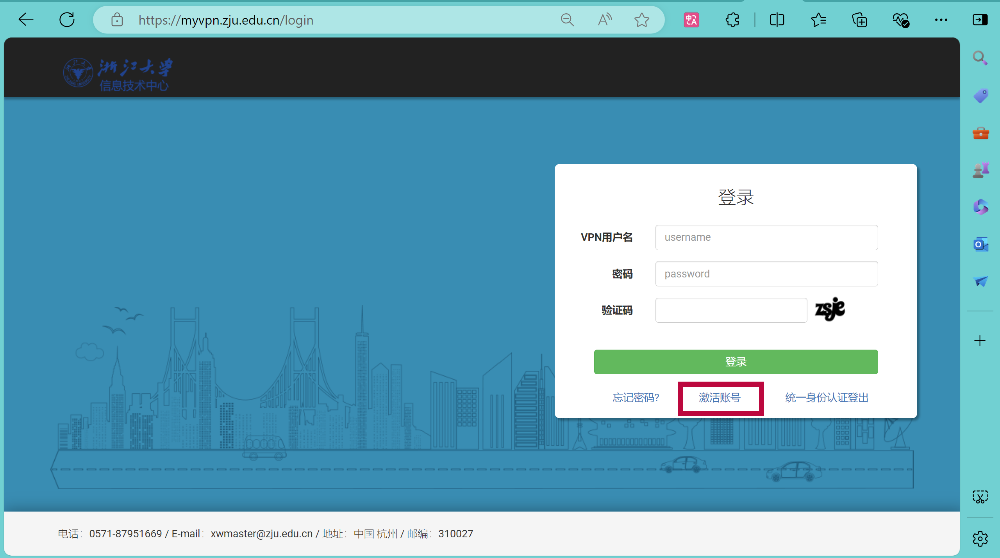
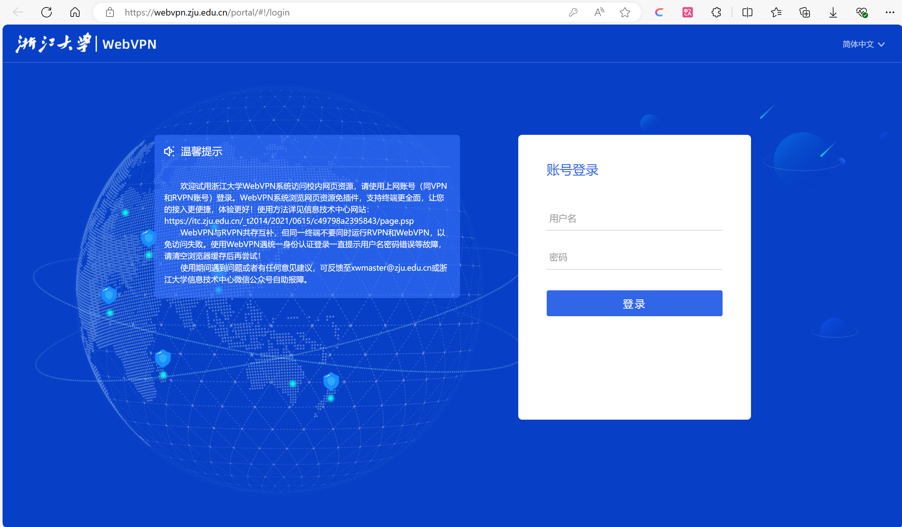
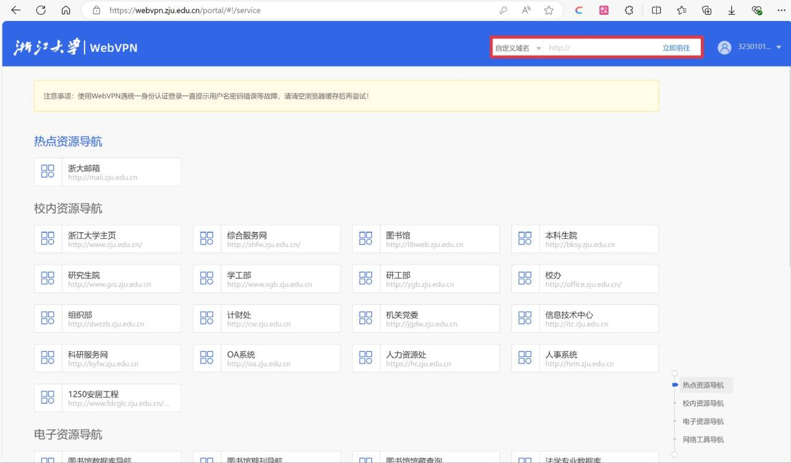
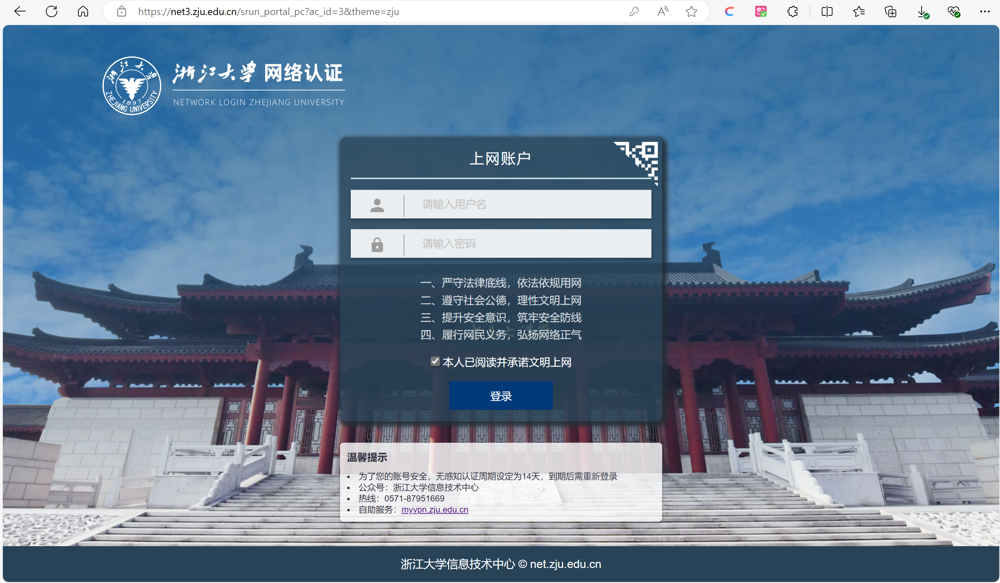
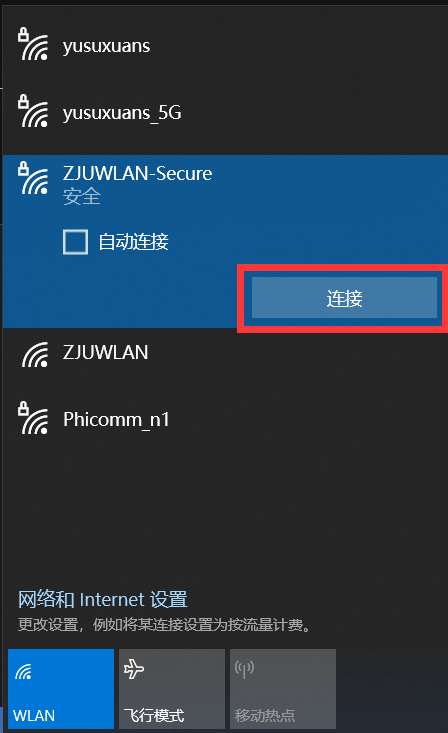
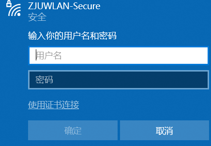
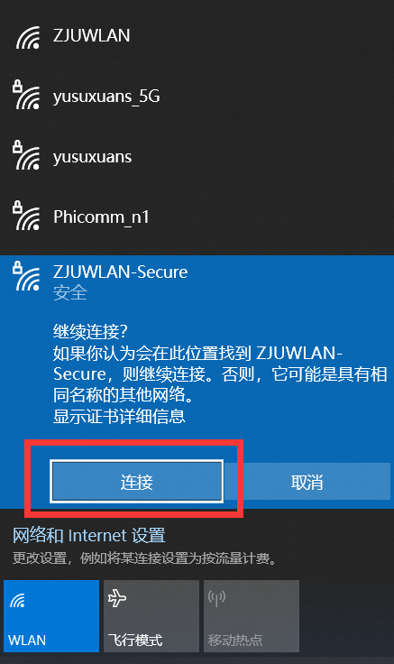
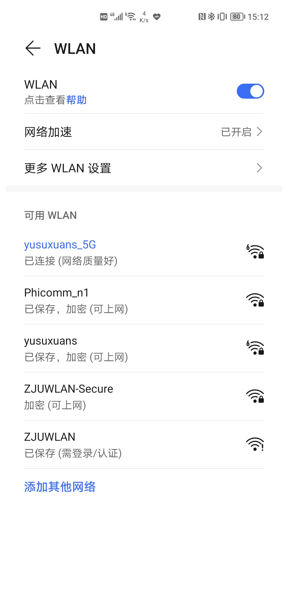
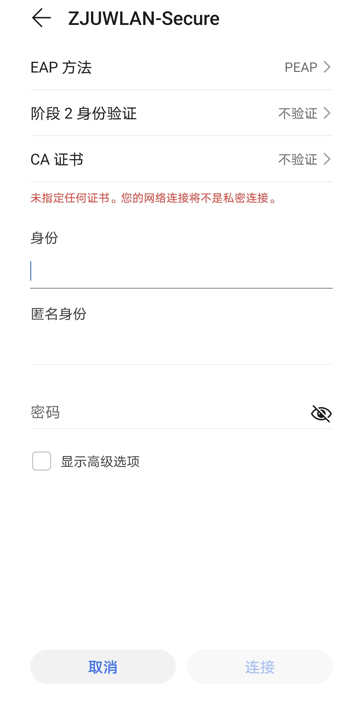

# 校园网连接指南

!!! Note "序言"
    - 校园网是必需的，在办理好校园网后，才可以使用浙大里的无线网以及访问浙大校内资源。
    - 校园网需要先激活再缴费（第一个月可以不用缴费）。在校外可以选择 WebVPN 或 ZJU Connect 连接访问校内资源，进入校园后可以采用无线等方式更便捷的连接校网。其中，使用无线网及 WebVPN 就足以满足一定的需求了。
    - 本文中提到的网络密码不一定和浙江大学统一身份认证所用密码相同，在具体使用时还请注意。

## 激活及缴费

!!! Warning "注意"
    第一个月的校网是免费的，不需要充值，但是**一定要激活**。

### 激活

进入网站 [myvpn.zju.edu.cn](https://myvpn.zju.edu.cn/) 或者通过浙大钉—工作台—全部—网络缴费进入信息技术中心网站，这里将浙大钉换为钉钉也可以。

!!! Note "网页版激活界面"
    

第一次使用 VPN 之前先要激活账号，点击“激活账号”可跳转到浙江大学统一身份认证并激活（可能会用到校园卡密码，身份证后六位）。

!!! Warning "注意"
    钉钉校园卡分别有卡号和学号两项，其中学号是名字右侧 324 开头的十位数字，本文中要用到的只有学号.

### 缴费

成功激活后，回到 [myvpn.zju.edu.cn](https://myvpn.zju.edu.cn/)，输入 VPN 用户名（即学号）和密码并进行缴费。

套餐一共有三种，其费用及对应带宽见下面表格，不过由于校园网络存在升级，具体数据仅供参考。

|费用（元 / 月）|带宽（Mbps）|
|:---:|:---:|
| 10 | 10 |
| 30 | 50 |
| 50 | 100|

个人感觉 **10 元/月** 已经足够日常使用了。 

办理了学校杭州移动或电信电话卡的同学可以免费升级一个价位的套餐，购买了电话卡且想要升级的需持身份证前往相应营业厅办理。 

## 校外连接

校外连接方式主要有 WebVPN 和 RVPN 两种。

### WebVPN

WebVPN 是一种通过网页跳转来实现外网访问内网的连接方式，因此无需安装软件即可访问内网资源。

首先进入 [webvpn.zju.edu.cn](https://webvpn.zju.edu.cn/)，可以看到以下界面，然后输入用户名及网络密码并登录，这里的网络密码可能与统一身份认证密码不同。

成功登录后，在以下界面红框所圈的搜索框输入要访问的学校网址即可。（例如 [cc98.org](https://www.cc98.org/)）

### RVPN

- **ZJU Connect** 是**比较推荐**的一种校外连接方式，具体安装可以参考 [cc98 的这篇文章](https://www.cc98.org/topic/5704061)，这里需要先连上校网才能查看，推荐先用 WebVPN 连接校网查看。其在 GitHub 上的开源项目为 [ZJU Connect](https://github.com/Mythologyli/zju-connect)，这个软件在 Windows 系统上还有方便操作 GUI 的版本 [ZJU Connect for Windows](https://github.com/mythologyli/zju-connect-for-Windows)，是非常推荐使用的。

- **EasyConnect** 是一种较为简单但是**不太推荐**的连接方式，其存在诸多弊端。若感兴趣，可以参考 [EasyConnect 的使用方法](https://mp.weixin.qq.com/s/uAjXZqi7Oi7oTmtJGVdtMA)。

## 校内连接

### 无线连接

校园内的 Wi-Fi 网络基本可以覆盖到日常学习生活的大部分区域，主要有 ZJUWLAN、ZJUWLAN-Secure。

ZJUWLAN 在 Wi-Fi 里可以直接找到并连接，但是需要认证，一般在连接后会弹出认证窗口，在填写好用户名、密码后，即可正常上网。一次认证有效时长为 14 天，到期后需要重新认证。

!!! Note "网页版认证界面"
    

如果没有弹出的话也可以直接访问 [net3.zju.edu.cn](http://net3.zju.edu.cn)，进入认证界面。

ZJUWLAN-Secure 在连接时，在输入所用的用户名、密码后即可完成连接，下面简要介绍 Windows 以及 Android 系统上的操作。

=== "Windows"
    点击桌面右下方菜单栏中的无线网图标，选择 ZJUWLAN-Secure 进行连接，在输入用户名及密码后，点击连接后即可上网。
    ???+ General "操作步骤"
        === "Step 1"
            

        === "Step 2"
            

        === "Step 3"
            

        === "Step 4"
            

=== "Android"
    在手机中进入 WLAN 连接页面，选择 ZJUWLAN-Secure 进行连接，之后的阶段 2 身份认证和 CA 证书均选择**不认证**，在输入用户名和密码后，点击连接即可。
    ???+ General "操作步骤"
        === "Step 1"
            

        === "Step 2"
            

### 有线连接

不太推荐使用有线连接，个人感觉浙大的有线网络并不比无线网络快，而且很不稳定，并且会和其他代理产生冲突，所以很麻烦，不建议使用。

若还是有需求，可以参考[如何在寝室用有线上网呢](assets/如何在寝室用有线上网呢.pdf)。

!!! Warning "特殊情况"
    连接校园网后可能遇到的小问题：如果连接校园网后发现可以正常登录 QQ，但是无法打开网页的情况可参考[这篇文章](https://mp.weixin.qq.com/s?mid=2649491759&sn=265e8378ad15aa5536c17c87c4e75272&idx=1&__biz=MjM5OTk0NTg3Mg==)进行修复。
