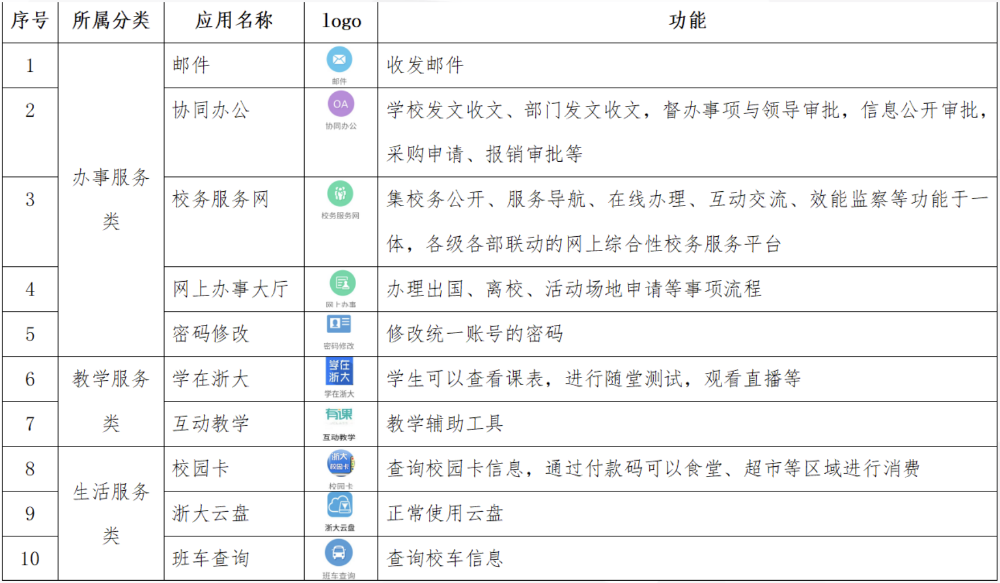
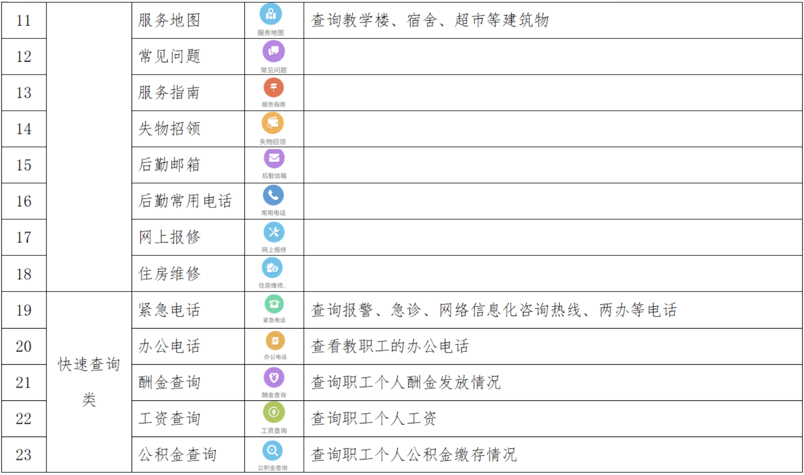
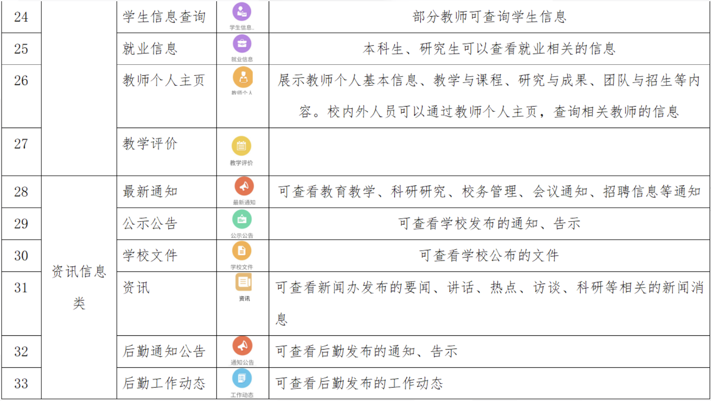
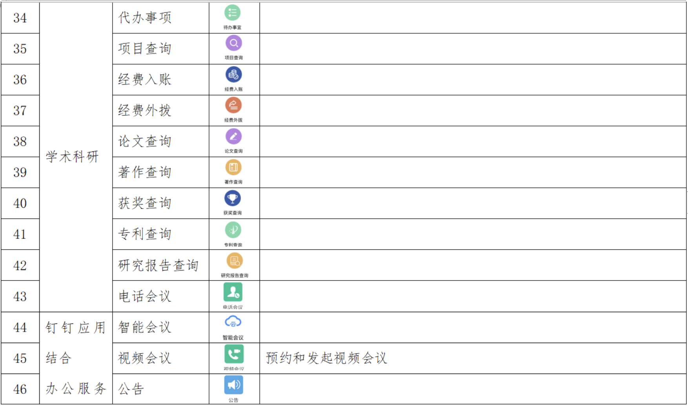

# 实用工具推荐

!!! abstract
    本文旨在向刚刚进入图灵班的学弟学妹们介绍和推荐一些在大学的学习和生活中比较实用的小工具和小软件，希望能对大家有所帮助！

## 学习部分

### 搜索引擎

关于搜索，每个人有不同的习惯，笔者的建议是至少彻底离开百度，因为他在学术方面的很多内容并不准确，而且常常夹带私货。个人建议使用必应搜索或者谷歌搜索（条件允许的话），其中必应搜索分为国内版和国外版，国内版方便检索中文内容，国际版则使用英文搜索，搜索英文网页效果很好。

其次，如果你想要更高级、更精确的搜索，那么你需要善用搜索引擎的一些独特功能，比如必应搜索：

- [advanced-search-options](https://support.microsoft.com/en-us/topic/advanced-search-options-b92e25f1-0085-4271-bdf9-14aaea720930)
- [advanced-search-keywords](https://support.microsoft.com/en-us/topic/advanced-search-keywords-ea595928-5d63-4a0b-9c6b-0b769865e78a)

另外，作为一个计算机人，一定要学会找官方的东西，比如官方网站、官方文档。例如你想要找某些语言的第三方模块的用法，可以先去 GitHub 上搜一搜，看看有没有开源，如果开源了的话它的 README 中一般是会有官方文档链接的。搜索代码的话可以直接使用 [GitHub Search](https://github.com/search)，它可以通过正则等很多搜索手法搜索整个 GitHub 上的代码，很好用。

同时，已经是大学生了，不要看到英文资料就敬而远之，要耐下心来看进去，不要总惦记到处找各种中文翻译版内容了。

当然，在学习中遇到问题时，我们也很鼓励大家向身边的同学、学长学姐或者是老师们请教。请见[《提问的智慧》](https://github.com/ryanhanwu/How-To-Ask-Questions-The-Smart-Way/blob/main/README-zh_CN.md)。

### 一些有用的网站 / 在线工具

- [Google](https://www.google.com/)：任何课程的名校讲义、录像等一切资源，以及高质量的知识检索； 
- [MIT ocw](https://ocw.mit.edu/)：MIT 开设的许多课程的完整录像及作业、讲义和其他材料； 
- [Z-library](https://singlelogin.re/)：上面有大量中外书籍的电子版（**注意甄别某些看似一致的钓鱼网站！**）；
- [Bilibili](https://www.bilibili.com/)：许多外国课程的字幕版，国语优质课程录像及网课；
- [YouTube](https://www.youtube.com/)：许多国外网课和课程录像 (YouTube 自带机翻 )；
- [中国大学 mooc](https://www.icourse163.org/)：国内大学精心设计的网课 (含作业) 及课程录像；
- [谷歌学术](https://scholar.google.com/)（附[国内镜像网](scholar.hedasudi.com/)）：国内外的学术论文搜索引擎；
- [中国知网](https://cnki.net/)：中国最大的学术论文数据库；
- [万方数据](https://www.wanfangdata.com.cn/)：同样有名的学术数据库；
- [GitHub](https://github.com/github)：全球最大的开源网站，在这里推荐各位可以提前了解一下 Git 的常见操作，以下学习资料可供参考：
    - [Git/GitHub 及开源基础 | 实用技能拾遗第二讲 | 浙江大学竺可桢学院学业指导中心辅学精品课](https://www.bilibili.com/video/BV12u4y177vG)
    - [MIT Missing Semester](https://www.bilibili.com/video/BV1Wh4y1s7Lj)
- [Cpp Reference](https://en.cppreference.com/w/)：C 语言的参考网站；
- [Notion]([https://www.notion.so](https://www.notion.so/))：比较好用的在线笔记；
- [GeoGebra](https://www.geogebra.org/calculator)：在线的几何画板，可以画出各种函数的图像；
- [Wolfram | Alpha](https://www.wolframalpha.com/)：强大的在线计算器，可以处理包括积分、求极限等复杂运算；
- [Draw.io](https://app.diagrams.net/)：在线画图软件，后续写 report 的时候如果需要绘制图论相关的图可以用此软件绘制；
- [Table Translator](https://tablesgenerator.com/)：可以帮助对于 LaTeX 或者 html 语法不是很熟练的同学较为方便地生成一个表格的源码；
- [Overleaf](https://www.overleaf.com/)：比较好用的在线 LaTex 编辑器，支持实时预览和多人协作等功能，可以用来比较方便地写论文和报告；
- [Celechron](https://www.cc98.org/topic/5947195/1)：Celechron 主要提供日程、课表、课程、成绩的查询功能。界面 UI 很舒服，使用很流畅，个人认为比求是潮 Mobile 要更好用。

### 使用大语言模型

正确使用大语言模型可以大大提高学习效率。目前国际上比较流行的大语言模型有 ChatGPT、Claude、Google Bard 等，国内有文心一言、智谱清言等。大部分大语言模型都有免费模型可以使用，可以自行探索下比较好用的。

目前最为常用的大语言模型是 ChatGPT，在[官网](https://chatgpt.com/)可以免费访问 GPT-4o 使用。有几点问题要注意，一是需要科学上网；二是使用有时可能会报错，需要反复刷新页面，重新提问来解决问题。当然也可以每月 20 美元购买 Plus 以获得比较好的体验，不过一般情况下没有必要买。

同时还推荐同学使用 Copilot，作为一款 AI 编程工具，它支持大部分编程语言，可以根据提示帮助编写代码，同时还能为代码生成注释。

**注意，大语言模型只是辅助大家更便利获取知识的工具，一定不要过度依赖，更一定不要将它创作的内容直接复制粘贴成为自己的作业、论文！**一般的大语言模型生成的论文和报告痕迹都比较明显，且已经有了不少识别 AI 创作内容的工具，很容易被老师查出。同时，过于依赖 GPT 完成各项作业不利于对自己能力的提升。

### 图灵班学习指南网站

你们的学长学姐（包括学爷学祖）们新建立了一个网站[图灵班学习指南](https://zju-turing.github.io/TuringCourses/)，上面收集了同学们学习各种通识课、专业课等等课程的经验与建议，大部分大一的基础课程已经有了较为完善的内容，而且还有书评专区等等，同学们如果想了解各种课程的信息可以尝试在这里寻找答案。

此外，这个网站仍在发展建设之中，欢迎同学们在未来参与到网站的建设中~（贡献指南也在这个网站里）。想要加入到 [ZJU-Turing GitHub Organization](https://github.com/ZJU-Turing) 中的同学可以联系管理员。

> 这个网站是基于 GitHub Pages 搭建的，所以**可能**需要翻墙才能访问。

## 生活部分

### 常用官方网站（一般需要校网）

* 官方文件/通知 
    - 本科生院网：https://bksy.zju.edu.cn
    - 竺院办公网：http://office.ckc.zju.edu.cn（有一些资料在中文网上找不到）
    - 综合服务网：http://zhfw.zju.edu.cn
    - 学工部网站：http://www.xgb.zju.edu.cn
    - 团委网站：https://zjutw.zju.edu.cn
* 其他
    - 素测网：https://ckcyouth.zju.edu.cn/zs/index（可以用于查询综素分）
    - 素拓网：http://www.youth.zju.edu.cn/sztz/（可以用于查询二三课分）
    - 正版软件：http://ms.zju.edu.cn/（可下载matlab等正版软件）
    - 团在浙大：http://tzzd.zju.edu.cn/（可以用于报名社团精品课，借尧坤楼教室）
    - 浙大图书馆：http://libweb.zju.edu.cn/（可以用于图书馆座位预约、馆藏查询与借书预约）
* **这里推荐一个整合的网站：https://zjuers.com/ 里面基本上涵盖了平时会用到的所有网站。**

### 常用公众号

* **浙江大学**：浙江大学官方公众号；
* **浙大微学工**：“浙大微学工"是浙江大学党委学生工作部官方新媒体平台致力于"为学生发展谋划，帮学生排忧解难，做学生知心朋友，促学生健康成长"，由求是潮工作团队运营，是学校学生工作中最全面和专业的公众号；
* **浙大后勤**：服务中心-小白车查询 可以查看小白目前的位置；
* **浙大学生公寓管理服务中心**：iHome 里可以给寝室电表充值，订矿泉水；
* **浙大生活**：生活服务功能中集合了自习空间（包括自习教室空余的实时查看、图书馆自习位置以及蒙民伟自习空间的预约等功能），网上订餐（也就是<del>味同嚼蜡的</del>学霸餐），小白车位置的查看，校园地图等功能，可以说校园内的生活服务都在这里；
* **浙江大学图书馆**：可以进行自习座位的预约与图书的借阅，不过钉钉工作台上的图书馆功能或许更方便；
* **竺院团学汇**：竺院各学生组织（包括但不限于学生会、团委、学促、全媒体）的活动和通知都会发布在这里，也会搬运一些竺院官网上的通知；
* **浙大体育与艺术**："浙大体育与艺术"平台隶属浙大体艺部，致力于为同学们提供课外锻炼、体质健康、运动贴士的查询服务，还有校园体艺活动、体艺竞赛与展演、体艺新闻等多种活动信息的通知、索票等服务；
* **浙大竺院人**：浙江大学竺可桢学院团学工作宣传平台，主要面向在校生，发布与同学们学习、生活密切相关的信息；
* **浙大图灵班**：浙江大学图灵班自己的公众号。

### 校内论坛

#### CC98

CC98 是浙江大学校网内规模最大的论坛，有[网页版](https://www.cc98.org/)和微信小程序（都需要校园网或使用 webvpn/rvpn 才能登上）。

在这里，你可以交流任何问题，可以找到各种学习资源，可以找到留学、找工作等经验分享,可以看到帅气 xgg 漂亮 xjj，可以看到各种令人震撼的心灵故事，<del>还可以在这里找到属于自己的缘分</del>。

总之，my cc98, my home!

#### 朵朵校友圈

朵朵校友圈是由云朵朵微信个人号发展而来的校园互助信息平台，主要是微信小程序的形式。  
主要功能包括但不限于提供校园公益互助信息发布平台，树洞、吐槽等匿名功能，以及以在校生活、学习为核心的学校信息查询与处理。

### 浙大钉的各项功能介绍

在我们的日常学习中，有很多校务相关的操作都是通过浙大钉里面的工作台来完成的，下表是对于浙大钉工作台各项功能的介绍：

### 常用小程序

- 尼普顿智慧生活：可以来寻找空闲充电桩来给自己的小龟充电；
- 兰德力自助洗：可以来预约寝室楼内的公共洗衣机等。
